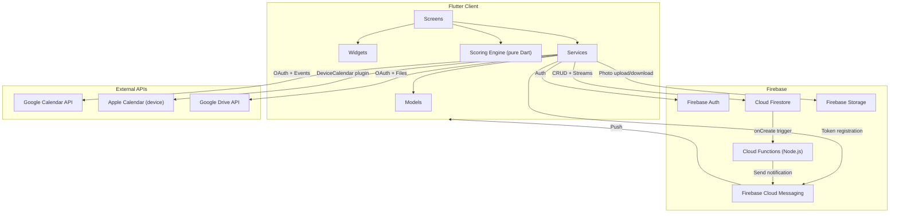

# TDD: Kairos MVP -- Technical Design Document

| Field            | Value                                      |
|------------------|--------------------------------------------|
| **Document ID**  | TDD-MVP                                    |
| **Covers**       | Full MVP (existing + new features)         |
| **PRD Reference**| PRD-MVP v2.0                               |
| **Author**       | Engineering                                |
| **Status**       | Draft                                      |
| **Created**      | 2026-03-19                                 |

---

## Table of Contents

### Part 1: System Architecture
1. [System Overview](#1-system-overview)
2. [Tech Stack](#2-tech-stack)
3. [Firestore Data Model](#3-firestore-data-model)
4. [Security Model](#4-security-model)
5. [Real-Time Architecture](#5-real-time-architecture)
6. [Deployment Topology](#6-deployment-topology)

### Part 2: Feature Specs
7. [Auth & Onboarding](#7-auth--onboarding)
8. [Guided First Check-in (NEW)](#8-guided-first-check-in-new)
9. [Spaces & Membership](#9-spaces--membership)
10. [Dashboard & Solo Mode (NEW)](#10-dashboard--solo-mode-new)
11. [Pulse Check-ins & Streak System (NEW)](#11-pulse-check-ins--streak-system-new)
12. [Health Score Engine](#12-health-score-engine)
13. [Planned Moments](#13-planned-moments)
14. [Moment Lifecycle & Prompting](#14-moment-lifecycle--prompting)
15. [Memories](#15-memories)
16. [Memories Tab (Showcase)](#16-memories-tab-showcase)
17. [Activity Trail](#17-activity-trail)
18. [Push Notifications & Re-engagement (NEW)](#18-push-notifications--re-engagement-new)
19. [Calendar Integration](#19-calendar-integration)
20. [Settings](#20-settings)

---

# Part 1: System Architecture

## 1. System Overview



### Data Flow Summary

| Flow | Pattern |
|------|---------|
| Read (live) | Firestore stream -> StreamSubscription -> setState / ValueNotifier -> Widget rebuild |
| Read (one-time) | Firestore get -> async/await -> setState |
| Write | Service method -> Firestore batch/transaction -> Activity log -> Cloud Function trigger -> FCM push |
| Score computation | Check-in stream -> CheckInScoreSource -> ScoreEngine (pure Dart) -> ScoreResult -> ValueNotifier -> HealthCard |
| Photo storage | ImagePicker -> compress (pure Dart) -> Firebase Storage or Google Drive -> store paths in Firestore |

---

## 2. Tech Stack

| Layer | Technology | Rationale |
|-------|-----------|-----------|
| **Framework** | Flutter 3.10+ / Dart ^3.10.7 | Cross-platform iOS + Android from single codebase |
| **State** | setState + ValueNotifier | Intentionally simple; no Riverpod/Bloc. ValueNotifier for localized rebuilds on dashboard |
| **Backend** | Firebase (Auth + Firestore + Storage + FCM + Functions) | Serverless, real-time streams, zero backend ops |
| **Navigation** | GoRouter | Declarative routing with auth guards, deep linking |
| **Scoring** | Pure Dart (no Flutter deps) | Testable, portable; `ScoreSource` interface for future extensibility |
| **Fonts** | Google Fonts (Outfit, Inter, Cormorant Garamond) | Premium typography without bundling font files |
| **Calendar** | googleapis + device_calendar | Google Calendar via OAuth; Apple Calendar via device plugin |
| **Drive** | googleapis (drive.file scope) | User-owned photo storage; app-only file access |

### Why Not...

| Alternative | Reason for rejection |
|-------------|---------------------|
| Riverpod / Bloc | Overkill for current complexity. setState + ValueNotifier covers all cases. Revisit if screen count doubles. |
| Supabase / custom backend | Firebase's real-time streams are core to the product feel. Migration cost not justified. |
| SQLite / Hive for offline | MVP explicitly does not support offline. Firestore persistence can be enabled later as a quick win. |
| Cached network images | In-memory URL cache in StorageService is sufficient. Disk caching adds dependency without clear ROI at current scale. |

---

## 3. Firestore Data Model

### Collection Hierarchy

```
firestore/
├── invites/{inviteId}
├── users/{userId}
└── spaces/{spaceId}
    ├── moments/{momentId}
    │   └── editing/{editorId}
    ├── memories/{memoryId}
    ├── checkins/{checkinId}
    └── activities/{activityId}
```

### 3.1 Space

```
spaces/{spaceId}
  name: string
  memberIds: string[]              // [userId1, userId2] -- max 2 in MVP
  createdBy: string
  createdAt: timestamp
  updatedAt: timestamp
  pulseConfig: {
    userPicks: {
      [userId]: [attrId, attrId, attrId]   // each user picks 3
    }
    updatedAt: timestamp
  }
```

### 3.2 User

```
users/{userId}
  name: string
  spaceId: string?
  avatarKey: string?
  createdAt: timestamp
  updatedAt: timestamp
  fcmTokens: { [token]: { platform, device, updatedAt } }
  hasCompletedOnboardingCheckin: bool         // NEW: guided onboarding flag
  checkinReminderEnabled: bool               // NEW: daily reminder toggle
  checkinReminderTime: string?               // NEW: "21:00" format
  weeklyDigestEnabled: bool                  // NEW: weekly digest toggle
  integrations: {
    calendar: { provider, accountEmail, linkedAt }?
    driveStorage: { accountEmail, linkedAt }?
  }
  notificationPreferences: {
    globalEnabled: bool
    activityConfigs: { [type]: { enabled: bool, priority: string } }
  }
```

### 3.3 Moment

```
spaces/{spaceId}/moments/{momentId}
  name: string
  type: 'connect' | 'celebrate' | 'escape' | 'external'
  startDate: timestamp (UTC midnight)
  endDate: timestamp? (UTC midnight)
  timeSlot: 'morning' | 'afternoon' | 'evening' | 'night'?
  notes: string?
  createdBy: string
  createdAt: timestamp
  updatedAt: timestamp?
  version: int                     // optimistic locking
  status: 'planned' | 'cancelled'
  externalEventIds: { [provider]: eventId }?
```

**Subcollection: `editing/{editorId}`**

```
  userName: string
  timestamp: timestamp             // refreshed every 30s, stale after 60s
```

### 3.4 Memory

```
spaces/{spaceId}/memories/{memoryId}
  // ID convention: {momentId}_{userId} for linked; auto for standalone
  createdBy: string
  momentId: string?
  momentName: string?              // denormalized at seal time
  momentType: string?
  momentDate: timestamp?
  momentEndDate: timestamp?
  momentTimeSlot: string?
  momentNotes: string?
  title: string?                   // standalone only
  photoPaths: string[]             // Firebase Storage paths or Drive file IDs
  thumbPaths: string[]             // 300px thumbnails, parallel to photoPaths
  caption: string?                 // max 280 chars
  place: string?                   // max 100 chars
  music: string?                   // max 100 chars
  checkinId: string?               // linked UserCheckIn document
  sentiment: 'lived' | 'missed'?  // per-user, null for legacy/standalone
  storageProvider: 'firebase' | 'drive'?
  reactions: { [userId]: emoji }
  date: timestamp (UTC midnight)
  createdAt: timestamp (server)
  updatedAt: timestamp?
```

### 3.5 UserCheckIn

```
spaces/{spaceId}/checkins/{checkinId}
  // ID: {userId}_{millisecondsSinceEpoch}
  userId: string
  timestamp: timestamp
  scores: {
    [attrId]: { value: int (1-100), weight: double }
  }
  notes: string
```

### 3.6 Activity

```
spaces/{spaceId}/activities/{activityId}
  type: string                     // e.g. 'checkin', 'moment_planned', 'memory_created'
  actorId: string
  actorName: string
  entityType: 'checkin' | 'moment' | 'memory' | 'space'?
  entityId: string?
  timestamp: timestamp (server)
  metadata: {
    // varies by type: momentName, momentType, scores, editedFields, emoji, etc.
  }
```

### 3.7 Invite

```
invites/{inviteId}
  code: string                     // 6-char, A-Z 0-9
  spaceId: string
  createdBy: string
  createdAt: timestamp
  expiresAt: timestamp             // createdAt + 7 days
```

---

## 4. Security Model

### 4.1 Firestore Rules Summary

| Collection | Read | Create | Update | Delete |
|-----------|------|--------|--------|--------|
| `invites` | Authenticated | Authenticated | Authenticated | Authenticated |
| `spaces` | Authenticated | Authenticated | Member (own pulseConfig picks only) OR new member joining | -- |
| `moments` | Member | Member | Member | Member |
| `editing` | Member | Member | Member | Member |
| `checkins` | Member | Member + `userId == auth.uid` + required fields | Member | Member |
| `activities` | Member | Member | Member | Member |
| `memories` | Member | Member + `createdBy == auth.uid` + required fields | Creator (content) OR member (own reaction key only) | Member + creator only |
| `users` | Self OR Space member | Self | Self | -- |

### 4.2 Firebase Storage Rules

- Path: `spaces/{spaceId}/memories/{memoryId}/{fileName}`
- Read/Write/Delete: space member
- Write constraints: max 10 MB, `image/*` content type

### 4.3 Auth Providers

- Email/Password (Firebase Auth)
- Google Sign-In (OAuth 2.0)
- Apple Sign-In (placeholder, requires paid developer account)

---

## 5. Real-Time Architecture

### 5.1 Stream Subscription Pattern

All Firestore streams follow a consistent lifecycle:

```dart
StreamSubscription? _sub;

@override
void initState() {
  super.initState();
  _sub = _firestoreService.watchXyz(...).listen((data) {
    if (!mounted) return;
    setState(() => _data = data);
  });
}

@override
void dispose() {
  _sub?.cancel();
  super.dispose();
}
```

### 5.2 ValueNotifier for Localized Rebuilds

Dashboard uses ValueNotifier to avoid full-page rebuilds:

```
Firestore Stream          ValueNotifier            ValueListenableBuilder
─────────────────         ─────────────            ─────────────────────
watchUpcomingMoments  →  _momentsNotifier      →  ComingUpCard only
watchRecentCheckIns   →  _scoreNotifier        →  HealthCard only
                          (via ScoreEngine)
```

Memories tab uses ValueNotifier for slider sync:

```
_activeMember (ValueNotifier<int>)
  ├── _PhotoSlider listens → animateTo first photo of member
  └── _MemberCardSlider listens → animateTo member card
  (bidirectional with _isSyncing guard)
```

### 5.3 Editing Presence

```
User opens edit → setEditingPresence (write)
                  Timer.periodic(30s) → refresh timestamp
                  watchEditingPresence → stream to MDS/edit screen
User saves/back → clearEditingPresence (delete)
                  AppLifecycleState.paused → clearEditingPresence
Stale after 60s → cleanupStalePresence (GC on screen open)
```

### 5.4 Notification Delivery

```
Activity write → Firestore onCreate trigger → Cloud Function
                 → Read partner FCM tokens + preferences
                 → Build notification payload
                 → FCM multicast send
                 → Clean invalid tokens

Client receives → Foreground: FlutterLocalNotifications display
                  Background: system notification
                  Tap: NotificationNavigation → deep link to entity
```

---

## 6. Deployment Topology

| Service | Configuration |
|---------|--------------|
| Firebase Auth | Email/Password + Google provider enabled |
| Cloud Firestore | Production mode, rules deployed from `firestore.rules` |
| Firebase Storage | Rules from `storage.rules`, 10 MB / image cap |
| Cloud Functions | Node.js 18, `onActivityCreated` trigger, deployed via `firebase deploy --only functions` |
| FCM | APNs key uploaded for iOS; Android via google-services.json |
| Hosting | N/A (native mobile only) |

### Firestore Indexes

Composite indexes needed (auto-prompted on first query):
- `checkins`: `userId` ASC + `timestamp` DESC
- `activities`: `timestamp` DESC (single-field, default)
- `memories`: `createdBy` ASC + `date` DESC
- `moments`: `startDate` ASC (single-field, default)

---

# Part 2: Feature Specs

## 7. Auth & Onboarding

**Status:** Existing

### Frontend

| File | Role |
|------|------|
| `lib/screens/splash_screen.dart` | Auth detection, route to login or dashboard |
| `lib/screens/login_screen.dart` | Email/password + Google sign-in |
| `lib/screens/onboarding_screen.dart` | Multi-step wizard: name Space, profile, invite |
| `lib/screens/join_screen.dart` | Join via invite code |
| `lib/router/app_router.dart` | Route guards (`_handleRedirect`) |

### State

- `AuthService` wraps Firebase Auth. Singleton `GoogleSignIn` instance.
- `authStateChanges` stream drives splash routing.
- Auth token cached in SharedPreferences for quick startup check.

### Backend

- `FirestoreService.createSpace()`: creates space doc + invite doc in batch
- `FirestoreService.joinSpace()`: validates invite, adds user to memberIds, deletes invite
- Join validation: `inviteNotFound`, `inviteExpired`, `spaceFull`, `alreadyMember`

---

## 8. Guided First Check-in (NEW)

**PRD Reference:** FR-6.16

### What Needs Building

A new screen that intercepts the user after sign-up (before dashboard) and walks them through their first check-in in under 60 seconds.

### Frontend

**New file:** `lib/screens/onboarding/guided_checkin_screen.dart`

```
Route: inserted between onboarding completion and dashboard redirect
       (modify _handleRedirect in app_router.dart to check hasCompletedOnboardingCheckin)

Flow:
  1. Welcome card → "Let's see how your relationship feels right now"
  2. Attribute picker (reuse pulse attribute pills from main_shell.dart)
  3. Slider check-in (reuse VerticalBarSlider from dotted_slider.dart)
     + Live VoronoiMosaicPainter preview (reuse from health_card.dart)
  4. Completion card → "Check in tomorrow to see how it changes"
  5. Navigate to dashboard
```

**State management:**
- `StatefulWidget` with `TickerProviderStateMixin` (for mosaic animation)
- Local state: `_selectedAttributes`, `_scores`, `_step` (0-3)
- On completion: save pulse config + submit check-in + set `hasCompletedOnboardingCheckin = true`

**Reusable components:**
- `PulseAttribute` pills from `main_shell.dart` L562-579 (extract into shared widget)
- `VerticalBarSlider` from `lib/widgets/dotted_slider.dart`
- `VoronoiMosaicPainter` from `lib/widgets/painters/voronoi_mosaic_painter.dart`

### Backend

**Data writes (atomic batch):**
1. `spaces/{spaceId}.pulseConfig.userPicks[userId] = selectedAttributes`
2. `spaces/{spaceId}/checkins/{userId}_{timestamp}` = first check-in doc
3. `users/{userId}.hasCompletedOnboardingCheckin = true`
4. `spaces/{spaceId}/activities/{id}` = checkin activity

**Route guard change (`app_router.dart`):**
```dart
// In _handleRedirect, after confirming user has a space:
if (isLoggedIn && !isAuthRoute && currentPath.startsWith('/dashboard')) {
  final userDoc = await _firestoreService.getUserProfile(userId);
  if (userDoc?['hasCompletedOnboardingCheckin'] != true) {
    return '/onboarding-checkin/$spaceId';  // new route
  }
}
```

**SharedPreferences:** `has_completed_onboarding_checkin` as local cache to avoid Firestore read on every cold start.

### Edge Cases

- User kills app mid-flow: `hasCompletedOnboardingCheckin` stays false, flow re-shown on next launch
- Invited user who wants to skip: "Skip" button sets the flag without saving a check-in
- User already joined via invite and has existing check-ins: skip if check-in count > 0

---

## 9. Spaces & Membership

**Status:** Existing

### Frontend

- Space creation: `onboarding_screen.dart` wizard
- Join flow: `join_screen.dart` with invite code validation
- Invite sharing: share button in onboarding + Settings

### Backend

- `createSpace()`: batch write (space doc + invite doc + user profile update + activity)
- `joinSpace()`: transaction (validate invite -> add member -> delete invite -> log activity)
- Member limit: `memberIds.length >= 2` returns `JoinResult.spaceFull`
- Invite: 6-char, A-Z 0-9, 7-day expiry, single-use

### Future (Group Expansion)

When expanding to 3-8 members:
- Change `memberIds.length >= 2` to configurable max
- Cloud Functions: change `find` (single partner) to `filter` (all other members)
- UI: replace "partner" language with "members" throughout
- Health score: address uneven engagement weighting (OQ-6 in PRD)

---

## 10. Dashboard & Solo Mode (NEW)

**Status:** Dashboard existing; Solo mode NEW (PRD FR-6.14)

### Existing Dashboard Architecture

```
DashboardTab (StatefulWidget)
├── _buildMainGrid()
│   ├── ComingUpCard (ValueListenableBuilder<List<Moment>>)
│   ├── PlanMomentCard
│   ├── HealthCard (ValueListenableBuilder<ScoreResult>)
│   └── CheckInCard
├── MemoryPromptCard (if _promptMoment != null)
└── ActivityTrail
```

**State:**
- `ValueNotifier<List<Moment>> _momentsNotifier` — from `watchUpcomingMoments` stream
- `ValueNotifier<ScoreResult> _scoreNotifier` — recomputed from check-in stream via ScoreEngine
- `Moment? _promptMoment` — from `getPastMomentsAwaitingMemory` (one-time load)
- `int _streak` — from `getCheckInStreak`

### Solo Mode Changes

**Condition:** `space.memberIds.length == 1`

**Health Card behavior:**
- Currently: gray mosaic until both members have checked in
- Solo mode: show **personal trend line** (user's own scores over time)
- Implementation: add a `_PersonalTrendCard` widget that shows a `TrendChartPainter` with the user's daily scores from `_cachedCheckIns`
- Switch logic in `_buildMainGrid`: `memberIds.length == 1 ? _PersonalTrendCard : HealthCard`
- Copy on personal trend: "Your pulse" with subtitle "Invite your partner to see your shared health score"

**Invite Card:**
- New widget: `_InvitePartnerCard` shown below the main grid when `memberIds.length == 1`
- Shows invite code + share button + "Invite your partner" CTA
- Dismissible (SharedPreferences `invite_card_dismissed`), re-accessible from Settings
- Non-blocking: does NOT prevent access to any features

**Coming Up / Moments / Memories / Activity Trail:** work identically in solo mode.

**Prompt Card:** works in solo mode (user can plan a moment, let it pass, and get the prompt).

### Backend Changes

- `getPastMomentsAwaitingMemory` already takes `userId` — works for solo
- Health score engine: already handles single-user (all scores are from one person)
- No Firestore schema changes needed

---

## 11. Pulse Check-ins & Streak System (NEW)

**Status:** Check-ins existing; Streak system NEW (PRD FR-6.15)

### Existing Check-in Architecture

```
CheckInScreen (StatefulWidget + TickerProviderStateMixin)
├── VoronoiMosaicPainter (grouped by attribute, colored by slider value)
├── VerticalBarSlider x 3-5 (dynamic from pulse config union)
├── Notes text field
└── SlideToAction (save)
```

**State:** `_scores` map, `_pulseConfig`, `_isSubmitting`, animation controllers for tile entrance + bar settle.

**Backend:** `submitCheckIn()` creates check-in doc + updates `space.updatedAt`. `logCheckInActivity()` logs to activity trail.

### Streak System -- What Needs Building

#### Frontend

**Dashboard streak display:**
- New widget: `_StreakBadge` in dashboard header area
- Flame icon (`Icons.local_fire_department_rounded`) with day count
- Active (streak > 0): accentRed flame + count, brief pulse animation on new day achieved
- Broken (streak == 0): dimmed warmMuted flame + "0"
- Tap: navigate to health details sheet (which shows full streak context)

**Implementation location:** Add to `dashboard_tab.dart` in the `_buildMainGrid` area or as a floating element near the health card.

**Settings additions:**
- `_CheckinReminderTile` in settings: toggle + time picker
- `_WeeklyDigestTile` in settings: toggle
- Both read/write from `users/{userId}` doc

#### Backend

**Streak calculation** (in `FirestoreService`):

```dart
Future<int> getCheckInStreak(String spaceId, {required String userId}) async {
  // Query user's check-ins ordered by timestamp DESC
  // Walk backwards from today, counting consecutive days
  // Grace period: if today hasn't been checked in yet, start from yesterday
  // Return count of consecutive days
}
```

Current `getCheckInStreak` exists but counts space-level streak. Needs to be per-user.

**Daily reminder Cloud Function (NEW):**

```typescript
// functions/src/index.ts -- new scheduled function
export const dailyCheckInReminder = functions.pubsub
  .schedule('every 1 hours')  // runs hourly, checks user's configured time
  .onRun(async () => {
    // 1. Query all users where checkinReminderEnabled == true
    // 2. For each user, check if current hour matches their reminderTime (in their timezone)
    // 3. Check if they have a check-in today (query space's checkins subcollection)
    // 4. If no check-in today: compute streak, send FCM with streak-aware copy
  });
```

Alternative (simpler MVP): use a single daily function at a fixed time (e.g., 8 PM UTC) and send to all users who haven't checked in. User-configurable time is a v2 enhancement.

**Weekly digest Cloud Function (NEW):**

```typescript
// functions/src/index.ts -- new scheduled function
export const weeklyDigest = functions.pubsub
  .schedule('every sunday 18:00')
  .onRun(async () => {
    // 1. Query all spaces
    // 2. For each space, for each member:
    //    - Compute score change this week
    //    - Get streak count
    //    - Count moments planned/lived this week
    // 3. Send FCM with summary copy
  });
```

**Data model changes:**
- `users/{userId}`: add `checkinReminderEnabled` (bool, default true), `checkinReminderTime` (string, default "21:00"), `weeklyDigestEnabled` (bool, default true)
- No new collections needed

---

## 12. Health Score Engine

**Status:** Existing, pure Dart

### Architecture

```
lib/scoring/
├── score_models.dart        # ScoreResult, ScoreContribution, InsightLabel, etc.
├── score_engine.dart        # ScoreEngine.computeScoreResult() -- full pipeline
├── score_source.dart        # Abstract ScoreSource interface
└── checkin_score_source.dart # CheckInScoreSource -- turns check-ins into contributions
```

### Pipeline

```
UserCheckIn[] → CheckInScoreSource.getContributions()
             → ScoreEngine.computeScoreResult()
                ├── Filter to 30-day window
                ├── Per-check-in: weighted average using saved config
                ├── Per-user/day: average of user's check-in overalls
                ├── Per-day: average of user-averages (equal weight per user)
                ├── Per-week: mean of daily scores (4 weeks)
                ├── Per-month: mean of weekly scores
                ├── Attribute averages + trends
                ├── Overall trend (-1..1)
                └── Insight label (Thriving/Growing/Steady/Cooling/Struggling/JustStarting)
             → ScoreResult
```

### Extensibility

The `ScoreSource` interface allows adding future signal sources (e.g., moment frequency, app usage) without modifying the engine:

```dart
abstract class ScoreSource {
  List<ScoreContribution> getContributions({
    required DateTime from,
    required DateTime to,
  });
}
```

### Solo Mode Consideration

The engine already works with single-user data. When only one member exists:
- Per-day combined score = that user's score (no averaging needed)
- `partnerCheckInCount = 0` — dashboard uses this to show personal trend instead of shared mosaic

---

## 13. Planned Moments

**Status:** Existing

### Frontend

| File | Role |
|------|------|
| `plan_moment_screen.dart` | Progressive-reveal creation form |
| `edit_moment_screen.dart` | Edit with optimistic locking + editing presence |
| `moment_details_sheet.dart` | DraggableScrollableSheet with full details + actions |

### Key Patterns

**Progressive reveal:** Fields appear as prior fields are completed. `_selectedType` -> name -> date -> time slot/range -> notes -> slide-to-save.

**Optimistic locking:**
```dart
// firestore_service.dart
Future<void> updateMoment({..., required int expectedVersion}) async {
  await _firestore.runTransaction((txn) async {
    final current = await txn.get(momentRef);
    if (current['version'] != expectedVersion) throw 'Version conflict';
    txn.update(momentRef, {..., 'version': expectedVersion + 1});
  });
}
```

**Editing presence:**
- Write: `setEditingPresence()` on edit screen open, refresh every 30s
- Read: `watchEditingPresence()` stream in MDS and edit screen
- Clear: dispose, save, back, `AppLifecycleState.paused`
- GC: `cleanupStalePresence()` removes docs older than 90s

### Backend

- `createMoment()`: batch write (moment doc + activity)
- `updateMoment()`: Firestore transaction with version check
- `deleteMoment()`: not a true delete -- sets `status: 'cancelled'`
- `watchUpcomingMoments()`: Firestore stream, excludes `cancelled`, filters `isUpcoming || spansToday`
- `watchAllMoments()`: Firestore stream, excludes `cancelled` and `external`

---

## 14. Moment Lifecycle & Prompting

**Status:** Existing (refactored in this session)

### Lifecycle Model

```
Moment status: planned | cancelled     (shared, objective)
Memory sentiment: lived | missed       (per-user, subjective)
```

Moment status and memory creation are fully decoupled. Both "Lived it" and "Missed it" create a memory document -- they differ only in the `sentiment` field.

### Prompt Card Architecture

**File:** `lib/screens/dashboard/widgets/memory_prompt_card.dart`

**Pattern:** Swipe-to-reveal (not Tinder rotation)

```
Stack
├── Background: Row of two action zones (left: Lived, right: Missed)
└── Foreground: Card with GestureDetector (horizontal drag)
    └── Transform.translate(offset: dragOffset) -- straight horizontal
```

**Commit logic:**
- Threshold: 35% of card width OR fling velocity > 800
- Below threshold: spring back via AnimationController
- Above threshold: animate off-screen, fire callback

**Haptics:**
- Drag start: lightImpact
- Threshold crossing: selectionClick
- Lived commit: 3x lightImpact at 0/60/120ms
- Missed commit: 2x heavyImpact at 0/150ms

**First-time hint:** Nudge animation via separate AnimationController (looping tilt right then left). Persisted via SharedPreferences `has_swiped_prompt`.

### Backend

- `createPromptMemory()`: batch write (memory doc with sentiment + activity log). Does NOT touch moment status.
- `getPastMomentsAwaitingMemory(spaceId, userId)`: past planned moments within 14 days, cross-referenced against user's existing memories to exclude already-responded moments.

---

## 15. Memories

**Status:** Existing (with sentiment field added in this session)

### Creation Flows

| Flow | Entry Point | Sentiment |
|------|------------|-----------|
| Prompt swipe (dashboard) | `MemoryPromptCard` | `lived` or `missed` (from swipe direction) |
| Prompt buttons (moment details) | `_buildMemorySection` | `lived` or `missed` |
| Full creation form | `CreateMemoryScreen` | null (standalone) or null (moment-linked via form) |

### Frontend

| File | Role |
|------|------|
| `create_memory_screen.dart` | Full form: photos, caption, place, music, embedded check-in |
| `edit_memory_screen.dart` | Edit form: photo diff, text fields, read-only check-in |
| `memory_detail_sheet.dart` | DraggableScrollableSheet with content + reactions |
| `memory_detail_page.dart` | Route target: loads memory by ID, shows sheet |
| `memory_photos_view.dart` | Fullscreen gallery: PageView + InteractiveViewer |

### Backend

- `sealMemory()`: batch write (memory doc + activity). Does NOT change moment status.
- `updateMemory()`: batch write (update doc + activity with editedFields)
- `deleteMemory()`: Firestore transaction (delete doc) + Storage cleanup + activity log. Does NOT change moment status.
- `setReaction()` / `removeReaction()`: field-level update on `reactions` map
- Photo storage: `StorageService` routes to Firebase Storage or `DriveStorageService` based on user's integration config

### Photo Storage Architecture

```
PhotoPickerGrid → ImageCompressor (pure Dart, 1200px max, 85% quality)
               → StorageService.uploadMemoryPhotos()
                   ├── Firebase Storage (default, max 3 photos)
                   │   Path: spaces/{spaceId}/memories/{memoryId}/{index}.jpg
                   │   Thumb: spaces/{spaceId}/memories/{memoryId}/{index}_thumb.jpg
                   └── Google Drive (user-connected, max 10 photos)
                       Folder: Kairos/{spaceName}/{memoryId}/
                       Permission: anyone with link can view
```

---

## 16. Memories Tab (Showcase)

**Status:** Existing (enhanced in this session)

### Architecture

```
MemoriesTab (StatefulWidget)
└── ListView.builder
    ├── "Memories" header (Cormorant Garamond)
    └── _TimelineEntryCard[] (one per moment group or standalone)
        ├── _buildHeader (icon + title + date)
        ├── _PhotoSlider (synced via ValueNotifier)
        │   └── GestureDetector → MemoryPhotosView (fullscreen gallery)
        └── _MemberCardSlider (synced via ValueNotifier)
            └── _MemberMemoryCard (label, caption, tags, pulse icons, dates)
```

### Slider Sync Architecture

```dart
// _TimelineEntryCard owns the sync state
final _activeMember = ValueNotifier<int>(0);

// Both sliders receive it:
_PhotoSlider(activeMemberNotifier: _activeMember, ...)
_MemberCardSlider(activeMemberNotifier: _activeMember, ...)

// Photo slider: on scroll end, maps photo index → member index → updates notifier
// Member slider: on scroll end, maps card index → updates notifier
// Each slider listens to notifier and animateTo when changed externally
// _isSyncing flag prevents A→notifier→B→notifier→A loops
```

### Custom Scroll Physics

```dart
class _SnapScrollPhysics extends ScrollPhysics {
  static final SpringDescription _snapSpring =
      SpringDescription(mass: 0.5, stiffness: 300, damping: 22);
  // Snaps to item boundaries (cardWidth + gap)
  // Uses ScrollSpringSimulation with the stiff spring
}
```

### Photo Height Adaptation

- Each photo's native dimensions are resolved via `NetworkImage.resolve()`
- Computed height: `tileWidth * (imageHeight / imageWidth)`, clamped to `[120, tileWidth]` (max = square)
- Slider height = tallest photo. Cards align to bottom via `Alignment.bottomCenter`
- `AnimatedContainer` smooths the height transition as dimensions resolve

---

## 17. Activity Trail

**Status:** Existing

### Frontend

**File:** `lib/screens/dashboard/widgets/activity_trail.dart`

- Paginated: 6 initial + 4 per page
- `StreamSubscription` on `watchActivities(spaceId, limit: currentLimit)`
- Per-item rendering: icon + color by type, actor name ("You" or partner), bold entity names, relative timestamp
- Tap navigable items to deep-link (check-in details, moment details, memory detail)

### Backend

- `watchActivities()`: Firestore stream ordered by `timestamp` DESC with limit
- `logActivity()`: generic activity writer used by all feature-specific log methods
- 15 activity types (see PRD section 6.10)

---

## 18. Push Notifications & Re-engagement (NEW)

**Status:** Activity notifications existing; Daily reminder and weekly digest NEW (PRD FR-6.15)

### Existing Notification Architecture

```
functions/src/index.ts
  onActivityCreated (Firestore onCreate trigger)
    → Read activity type + metadata
    → Find partner (memberIds.filter(id !== actorId))
    → Read partner's FCM tokens + notification preferences
    → Build title/body by activity type
    → Send FCM multicast
    → Clean invalid tokens
```

**Client-side:**
- `NotificationService`: singleton, handles FCM init, permissions, token management, local notification display
- `MainShell`: listens to notification tap stream for navigation
- Deep linking: `NotificationNavigation` model with `type`, `spaceId`, `entityType`, `entityId`

### Daily Check-in Reminder (NEW)

**Cloud Function:** `dailyCheckInReminder`

```
Trigger: Cloud Scheduler, every 1 hour
Logic:
  1. Query users where checkinReminderEnabled == true
  2. For each user, check if current UTC hour matches their reminderTime (converted)
  3. Query their space's checkins for today
  4. If no check-in today:
     a. Compute streak from recent check-ins
     b. Build copy:
        - Streak > 0: "Time to check in -- your {N}-day streak is at risk"
        - Streak == 0: "Start a new streak today"
     c. Send FCM to user's tokens
```

**Simpler MVP alternative:** Single daily run at 20:00 UTC (covers most US timezones' evening). Configurable time is post-MVP.

### Weekly Digest (NEW)

**Cloud Function:** `weeklyDigest`

```
Trigger: Cloud Scheduler, every Sunday 18:00 UTC
Logic:
  1. Query all spaces
  2. For each space, for each member where weeklyDigestEnabled == true:
     a. Compute score change this week (current vs. 7 days ago)
     b. Get streak count
     c. Count moments planned and memories created this week
     d. Build copy: "Your week: score {+/-}N, {streak}-day streak, {M} moments"
     e. Send FCM
```

### Data Model

New fields on `users/{userId}`:
- `checkinReminderEnabled: bool` (default true)
- `checkinReminderTime: string` (default "21:00")
- `weeklyDigestEnabled: bool` (default true)

---

## 19. Calendar Integration

**Status:** Existing

### Architecture

```
lib/services/calendar_service.dart
├── linkGoogle() → OAuth → find/create calendar → save CalendarIntegration
├── linkApple() → device_calendar permission → find writable calendar → save
├── syncToGoogle(moment, calendarId) → create all-day event
├── syncToApple(moment, calendarId) → create all-day event
├── fetchGoogleEvents(dateRange) → external events for Moments tab
└── fetchAppleEvents(dateRange) → external events for Moments tab
```

**Config storage:** `users/{userId}.integrations.calendar` (provider, accountEmail, linkedAt)

**Moment sync:** `externalEventIds` map on moment doc stores `{provider: eventId}` after sync.

**External events toggle:** `SharedPreferences` key `show_external_events` on Moments tab.

---

## 20. Settings

**Status:** Existing + new streak settings (NEW)

### Current Settings

| Setting | UI | Storage |
|---------|----| --------|
| Pulse Attributes | Tappable pills, 3 of 5 | `spaces/{spaceId}.pulseConfig.userPicks[userId]` |
| Space Name | Text field | `spaces/{spaceId}.name` |
| Integrations | Calendar + Drive toggles | `users/{userId}.integrations` |
| Sign Out | Button | Clears auth state + local data |

### New Settings (from Streak System)

| Setting | UI | Storage | Default |
|---------|----| --------|---------|
| Daily reminder | Toggle + time picker | `users/{userId}.checkinReminderEnabled` + `checkinReminderTime` | Enabled, 9 PM |
| Weekly digest | Toggle | `users/{userId}.weeklyDigestEnabled` | Enabled |

**Implementation:** Add two new tiles to the settings bottom sheet in `main_shell.dart`, grouped under a "Notifications" section header. Time picker can use `showTimePicker` (Material) or a custom wheel.

---

## Appendix: Files to Create for New Features

| Feature | New Files | Modified Files |
|---------|-----------|----------------|
| **Guided First Check-in** | `lib/screens/onboarding/guided_checkin_screen.dart` | `lib/router/app_router.dart` (route + guard), `lib/services/firestore_service.dart` (batch write) |
| **Streak System (frontend)** | -- | `lib/screens/dashboard/dashboard_tab.dart` (streak badge), `lib/screens/main_shell.dart` (settings tiles), `lib/services/firestore_service.dart` (per-user streak) |
| **Streak System (backend)** | `functions/src/dailyReminder.ts`, `functions/src/weeklyDigest.ts` | `functions/src/index.ts` (exports) |
| **Solo Mode** | -- | `lib/screens/dashboard/dashboard_tab.dart` (conditional health card / personal trend), `lib/screens/dashboard/widgets/` (invite card widget) |
| **Personal Trend Card** | `lib/screens/dashboard/widgets/personal_trend_card.dart` | `lib/screens/dashboard/dashboard_tab.dart` (conditional rendering) |
