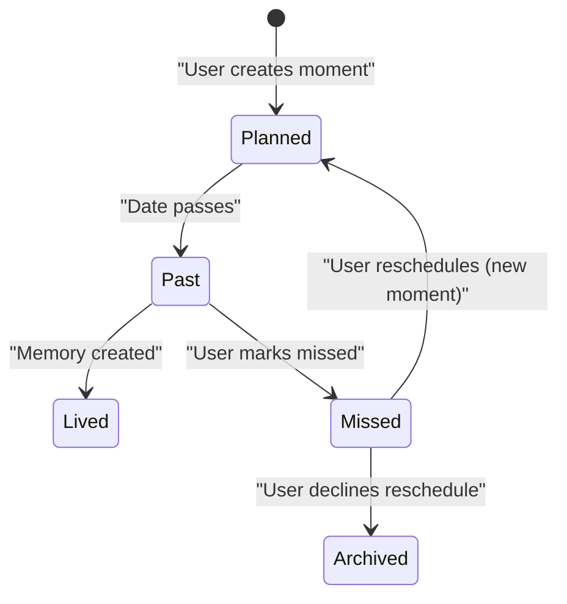
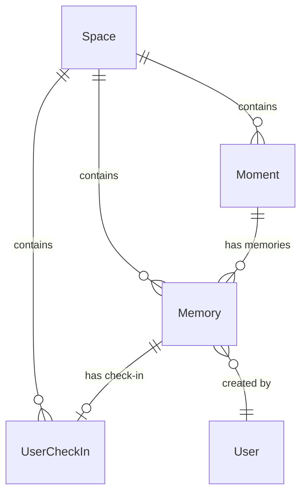
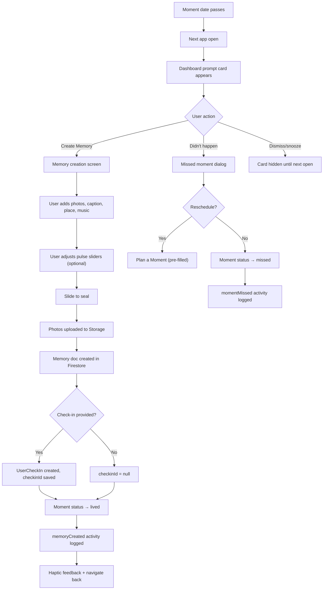
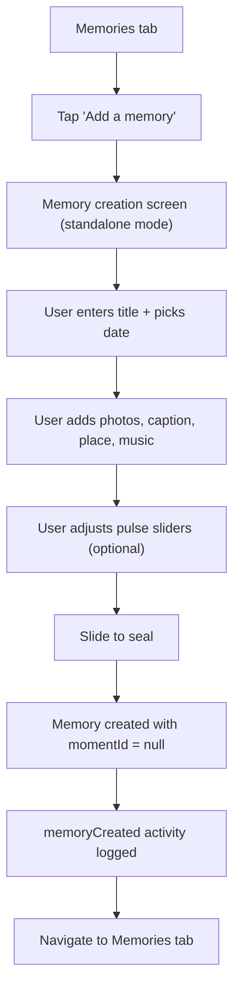
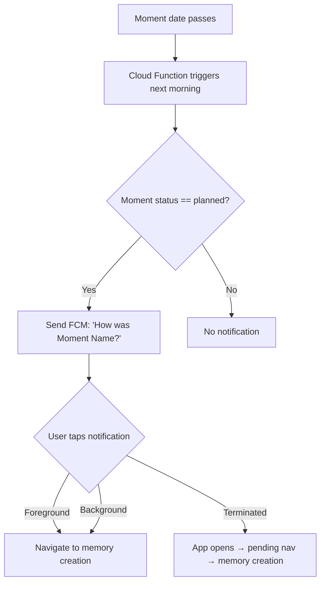

# PRD-001: Memories

| Field            | Value                                      |
|------------------|--------------------------------------------|
| **Document ID**  | PRD-001                                    |
| **Feature**      | Memories                                   |
| **Author**       | Product / Engineering                      |
| **Status**       | Draft                                      |
| **Created**      | 2026-03-12                                 |
| **Last Updated** | 2026-03-12                                 |
| **Target Release** | TBD                                      |
| **Stakeholders** | Product, Engineering, Design               |

---

## Table of Contents

1. [Executive Summary](#1-executive-summary)
2. [Background & Motivation](#2-background--motivation)
3. [Goals & Non-Goals](#3-goals--non-goals)
4. [User Personas](#4-user-personas)
5. [Functional Requirements](#5-functional-requirements)
   - 5.1 [Moment Lifecycle Update](#51-moment-lifecycle-update)
   - 5.2 [Memory Creation — From Lived Moment](#52-memory-creation--from-lived-moment)
   - 5.3 [Memory Creation — Standalone](#53-memory-creation--standalone)
   - 5.4 [Memory Content Model](#54-memory-content-model)
   - 5.5 [Missed Moment Flow](#55-missed-moment-flow)
   - 5.6 [Memories Showcase (Tab)](#56-memories-showcase-tab)
   - 5.7 [Prompting System](#57-prompting-system)
   - 5.8 [Activity Trail Integration](#58-activity-trail-integration)
6. [Non-Functional Requirements](#6-non-functional-requirements)
7. [Data Model](#7-data-model)
8. [User Flows](#8-user-flows)
9. [Navigation & Information Architecture](#9-navigation--information-architecture)
10. [Security & Privacy](#10-security--privacy)
11. [Scope & Phasing](#11-scope--phasing)
12. [Dependencies & Risks](#12-dependencies--risks)
13. [Success Metrics](#13-success-metrics)
14. [Open Questions](#14-open-questions)
15. [Appendix](#15-appendix)

---

## 1. Executive Summary

Memories is a new core feature for Kairos that closes the moment lifecycle loop. Today, users plan moments (Connect, Celebrate, Escape) and those moments silently expire once their date passes. Memories transforms that dead end into the most emotionally engaging part of the product: users capture how the moment felt through photos, a caption, a place, a song, and an embedded pulse check-in. The result is a sealed, immutable time capsule — personal to the creator but visible to both partners in a shared chronological timeline.

This feature directly increases retention (reason to return after moments pass), engagement depth (new content creation surface), and data richness (pulse check-ins tied to real experiences). It positions Kairos to monetize around storage, exports, and premium showcase features in future iterations.

---

## 2. Background & Motivation

### 2.1 Current State

- **Moments** are planned events with three types: Connect (quality time), Celebrate (occasions), Escape (getaways).
- The moment lifecycle is purely date-based. There is no explicit status field — a moment is "upcoming" or "past" based on its `startDate`/`endDate` relative to today.
- Past moments remain in Firestore but are **filtered out of all UI views**. Users have no way to revisit, reflect on, or document lived experiences.
- `ActivityType.momentCompleted` exists in the codebase but is **never triggered**.
- There is no post-moment flow of any kind.

### 2.2 Problem Statement

Once a moment's date passes, the app offers zero engagement. The user planned something meaningful, lived it, and the app provides no acknowledgment, no reflection surface, and no way to preserve the experience. This creates a dead zone in the user journey and a missed opportunity for the highest-emotion touchpoint in the product.

### 2.3 Opportunity

The post-moment window is when emotional investment peaks. A couple just had a date night, came back from a trip, or celebrated an anniversary. Capturing that moment while it's fresh creates:

- **Emotional lock-in**: A growing scrapbook of sealed memories that becomes harder to leave.
- **Engagement loop**: Plan → Live → Remember → Plan again.
- **Data depth**: Pulse check-ins tied to real experiences produce richer relationship health signals.
- **Monetization surface**: Photo storage, premium timeline views, PDF exports, "On This Day" nostalgia.

### 2.4 Competitive Landscape

| Competitor       | Post-Event Capture | Notes                                    |
|------------------|--------------------|------------------------------------------|
| Between          | Photo timeline     | Shared photo albums, no structured reflection |
| Paired           | Questions/games    | No post-event flow tied to planned dates  |
| Lovewick         | Journal entries    | Text-only, not tied to a planning system  |
| Google Photos    | Memories           | Auto-generated, no couple context         |
| Apple Photos     | Memories           | Auto-generated, no intentional capture    |

Kairos differentiates by tying structured reflection (pulse check-in, place, music, caption) to intentionally planned moments, creating a richer signal than passive photo timelines.

---

## 3. Goals & Non-Goals

### 3.1 Goals

| ID   | Goal                                                                              | Success Indicator                   |
|------|-----------------------------------------------------------------------------------|-------------------------------------|
| G-1  | Close the moment lifecycle (planned → lived → remembered)                         | >50% of past moments get a memory   |
| G-2  | Provide a low-friction, emotionally resonant creation flow                        | <3 min avg creation time             |
| G-3  | Create a shared showcase that couples want to revisit                             | Memories tab opened >2x/week/user   |
| G-4  | Increase pulse check-in frequency via embedded memory check-ins                   | +20% weekly check-in volume          |
| G-5  | Handle the "missed moment" case gracefully (reschedule or archive)                | <10% of past moments left in limbo   |
| G-6  | Support spontaneous/unplanned experiences via standalone memories                 | >15% of memories are standalone      |

### 3.2 Non-Goals (V1)

| ID   | Non-Goal                                                                          | Rationale                            |
|------|-----------------------------------------------------------------------------------|--------------------------------------|
| NG-1 | Google Places / map integration for locations                                     | Defer to reduce API cost and scope   |
| NG-2 | Spotify / Apple Music integration for music                                       | Defer to reduce third-party dependency |
| NG-3 | Memory editing after seal                                                         | Core design: immutable time capsule   |
| NG-4 | Monetization / paywall                                                            | Focus on retention and engagement first |
| NG-5 | Partner reactions to memories (likes, comments)                                   | V2 social layer                       |
| NG-6 | "On This Day" nostalgia prompts                                                  | Requires 1yr+ data, plan for future   |
| NG-7 | PDF / print export of memory scrapbook                                            | Premium feature for later             |
| NG-8 | Video attachments                                                                 | Storage cost; photos only for V1      |

---

## 4. User Personas

### 4.1 Primary: The Intentional Planner

- Plans moments ahead of time using the app
- Wants to document and preserve the experience after living it
- Values the "sealed time capsule" concept — treats it like a journal entry
- Likely to add photos, a caption, and a check-in

### 4.2 Secondary: The Spontaneous Documenter

- Doesn't always plan moments in advance
- Has spontaneous dates, surprises, or everyday meaningful moments
- Wants to capture these even though they weren't planned in the app
- Uses standalone memory creation

### 4.3 Tertiary: The Reluctant Partner

- May not be the primary planner but participates in moments
- Lower motivation to create detailed memories
- Needs the flow to be extremely low-friction (seal with minimal input)
- Benefits from the prompting system (dashboard card, notification)

---

## 5. Functional Requirements

### 5.1 Moment Lifecycle Update

**FR-5.1.1**: The `Moment` model SHALL include a new `status` field with values: `planned` (default), `lived`, `missed`.

**FR-5.1.2**: A moment's status SHALL transition to `lived` when the first memory is created for it by either partner.

**FR-5.1.3**: A moment's status SHALL transition to `missed` when a user explicitly marks it as "didn't happen".

**FR-5.1.4**: The `status` field SHALL NOT affect the existing date-based filtering logic. Past moments remain filtered from `watchUpcomingMoments` regardless of status.

**FR-5.1.5**: The lifecycle state diagram:



### 5.2 Memory Creation — From Lived Moment

**FR-5.2.1**: When a past moment has no associated memory and is not marked `missed`, the system SHALL present creation entry points (see FR-5.7).

**FR-5.2.2**: The memory creation screen SHALL be a single scrollable view with progressive reveal, consistent with the Plan a Moment screen pattern.

**FR-5.2.3**: When creating a memory from a moment, the screen SHALL pre-fill:
- Moment name displayed as a non-editable header
- Moment date displayed as context
- Moment type icon

**FR-5.2.4**: The creation screen SHALL include the following sections in order:

| #  | Section         | Input Type                  | Required | Max Length / Limit |
|----|-----------------|-----------------------------|----------|--------------------|
| 1  | Header          | Display only (name + date)  | N/A      | N/A                |
| 2  | Photos          | Image picker                | No       | 3 photos           |
| 3  | Caption         | Text field                  | No       | 280 characters     |
| 4  | Place           | Text field                  | No       | 100 characters     |
| 5  | Music           | Text field                  | No       | 100 characters     |
| 6  | Pulse Check-in  | Attribute sliders           | No       | N/A                |
| 7  | Seal Action     | Slide-to-save               | N/A      | N/A                |

**FR-5.2.5**: No field SHALL be strictly required. A memory MAY be sealed with only the moment link and date (zero additional content). This minimizes friction for the reluctant-partner persona.

**FR-5.2.6**: The seal action SHALL use the existing `SlideToAction` component with the label "Seal this memory".

**FR-5.2.7**: Upon sealing, the system SHALL:
1. Upload photos to Firebase Storage (if any)
2. Create the memory document in Firestore
3. Submit the embedded pulse check-in as a regular `UserCheckIn` (if sliders were interacted with)
4. Update the linked moment's `status` to `lived`
5. Log a `memoryCreated` activity
6. Provide haptic feedback (`heavyImpact`)
7. Navigate back to the previous screen or the Memories tab

**FR-5.2.8**: The memory document SHALL be immutable after creation. No update or edit operations SHALL be exposed in the UI or service layer.

### 5.3 Memory Creation — Standalone

**FR-5.3.1**: Users SHALL be able to create a memory without a linked moment, for spontaneous or unplanned experiences.

**FR-5.3.2**: The entry point SHALL be a button or FAB on the Memories tab.

**FR-5.3.3**: The standalone creation screen SHALL include all sections from FR-5.2.4, with the following modifications:
- **Header**: Replaced by a text field for the memory title/name (required, max 100 chars)
- **Date**: An inline date picker for when the experience happened (required, defaults to today, must not be in the future)

**FR-5.3.4**: The `momentId` field SHALL be `null` for standalone memories.

### 5.4 Memory Content Model

**FR-5.4.1 — Photos**:
- Users SHALL pick photos from the device gallery.
- Maximum of 3 photos per memory.
- Photos SHALL be uploaded to Firebase Storage under `spaces/{spaceId}/memories/{memoryId}/`.
- Each photo SHALL be limited to 10 MB.
- Thumbnails SHALL be displayed in the creation screen with a remove (X) button.
- Photo order SHALL be preserved as upload order.

**FR-5.4.2 — Caption**:
- Free-text field, max 280 characters.
- Placeholder text: "How was it?"
- Character counter displayed near the limit.

**FR-5.4.3 — Place**:
- Free-text field, max 100 characters.
- Placeholder text: "Where were you?"
- No autocomplete or map in V1.

**FR-5.4.4 — Music**:
- Free-text field, max 100 characters.
- Placeholder text: "A song that reminds you of this"
- No streaming integration in V1.

**FR-5.4.5 — Pulse Check-in**:
- Embedded pulse attribute sliders, reusing the existing check-in UI component.
- Sliders SHALL reflect the user's current pulse config (their 3 picked attributes + partner overlap).
- If the user interacts with any slider, a `UserCheckIn` document SHALL be created alongside the memory.
- This check-in SHALL count toward the relationship health score (same pipeline as regular check-ins).
- The `checkinId` SHALL be stored on the memory document for cross-reference.
- If the user does not interact with any slider, no check-in SHALL be created and `checkinId` SHALL be `null`.

### 5.5 Missed Moment Flow

**FR-5.5.1**: When a user is prompted about a past moment (via dashboard card or notification), they SHALL have two options:
- **"Create Memory"** — enters the memory creation flow (FR-5.2)
- **"Didn't happen"** — enters the missed moment flow

**FR-5.5.2**: Upon selecting "Didn't happen", the system SHALL present a confirmation dialog:
- Title: "Missed this moment?"
- Body: "Would you like to reschedule it?"
- Actions: **"Reschedule"** | **"No, dismiss"**

**FR-5.5.3**: If the user selects "Reschedule":
- Navigate to Plan a Moment screen pre-filled with the missed moment's details (name, type, notes).
- Dates SHALL NOT be pre-filled (user picks new dates).
- The original moment's status SHALL be updated to `missed`.

**FR-5.5.4**: If the user selects "No, dismiss":
- The moment's status SHALL be updated to `missed`.
- The moment SHALL be hidden from active views (dashboard, calendar).
- A `momentMissed` activity SHALL be logged.

**FR-5.5.5**: Missed moments SHALL remain in Firestore for data integrity. They SHALL NOT be deleted.

### 5.6 Memories Showcase (Tab)

**FR-5.6.1**: A new **Memories** tab SHALL be added as the third tab in the main navigation:
```
Dashboard  |  Moments  |  Memories
```

**FR-5.6.2**: The tab selector SHALL reuse the existing stretchy tab component, extended to 3 segments. The Memories tab icon SHALL be a book or photo-album icon.

**FR-5.6.3**: The Memories tab SHALL display a **vertical chronological timeline** (newest at top).

**FR-5.6.4**: Each memory SHALL render as a card containing:
- Photo(s): horizontal thumbnail strip or featured image
- Caption snippet (truncated if needed)
- Place tag (if present): location pin icon + text
- Music tag (if present): music note icon + text
- Mood indicator: derived from the pulse check-in attribute scores (if present)
- Creator: avatar + display name
- Date: formatted relative or absolute

**FR-5.6.5 — Moment Grouping**: When multiple memories are linked to the same `momentId`, they SHALL be grouped under a shared moment header:
- The header SHALL display the moment name, type icon, and date.
- Individual memory cards SHALL appear beneath the header, ordered by `createdAt`.
- This creates a "conversation thread" layout where both partners' perspectives are visible together.

**FR-5.6.6**: Standalone memories (`momentId == null`) SHALL appear as individual cards in the timeline, not grouped.

**FR-5.6.7**: Tapping a memory card SHALL open a full-screen detail view showing all content fields in a read-only, immutable layout.

**FR-5.6.8 — Empty State**: When no memories exist, the tab SHALL display:
- An illustration or icon
- Text: "Your story starts here. Live a moment, seal a memory."
- A CTA button if past moments without memories exist: "You have [N] moments to remember"

**FR-5.6.9 — Pagination**: The timeline SHALL load memories in pages (initial batch + load-more on scroll) to avoid loading all data upfront.

### 5.7 Prompting System

#### 5.7.1 Dashboard Prompt Card

**FR-5.7.1.1**: A prompt card SHALL appear on the dashboard when:
- The user has at least one past moment with `status == 'planned'` (no memory, not marked missed)
- The card SHALL show one moment at a time (the most recently passed moment first)

**FR-5.7.1.2**: The card SHALL contain:
- Moment type icon
- Moment name
- Moment date (formatted)
- Two CTA buttons: **"Create Memory"** | **"Didn't happen"**

**FR-5.7.1.3**: The card SHALL be dismissible (snooze). Dismissing SHALL NOT change the moment's status. The card SHALL reappear the next time the user opens the app.

**FR-5.7.1.4**: The card SHALL be positioned prominently on the dashboard (above the Coming Up card).

#### 5.7.2 Push Notification

**FR-5.7.2.1**: A push notification SHALL be sent when a moment's date passes:
- **Connect / Celebrate** (single-day): the following morning after `startDate`
- **Escape** (multi-day): the following morning after `endDate`

**FR-5.7.2.2**: Notification content:
- Title: "How was [Moment Name]?"
- Body: "Seal it as a memory before it fades"

**FR-5.7.2.3**: Tapping the notification SHALL deep-link to the memory creation screen for that moment.

**FR-5.7.2.4**: The notification SHALL only be sent if:
- The moment has `status == 'planned'` (no memory exists, not marked missed)
- The user has memory prompt notifications enabled

**FR-5.7.2.5**: A new entry SHALL be added to `NotificationPreferences`:

| Activity       | Default Priority | Default Enabled |
|----------------|-----------------|-----------------|
| Memory Prompt  | Normal          | Yes             |

### 5.8 Activity Trail Integration

**FR-5.8.1**: A new `ActivityType.memoryCreated` SHALL be added. Metadata:
- `memoryId`: the created memory's document ID
- `momentId`: the linked moment ID (if any)
- `momentName`: the moment name (or standalone memory title)

**FR-5.8.2**: A new `ActivityType.momentMissed` SHALL be added. Metadata:
- `momentId`: the missed moment's document ID
- `momentName`: the moment name
- `rescheduled`: boolean indicating if the user chose to reschedule

**FR-5.8.3**: Both activity types SHALL appear in the Activity Trail with appropriate icons and descriptions:
- Memory created: "You sealed a memory for [Moment Name]"
- Moment missed: "You marked [Moment Name] as missed"

---

## 6. Non-Functional Requirements

### 6.1 Performance

| ID      | Requirement                                                              | Target          |
|---------|--------------------------------------------------------------------------|-----------------|
| NFR-1   | Memory creation (seal) completes within                                  | < 3 seconds     |
| NFR-2   | Photo upload per image completes within                                  | < 5 seconds (on 4G) |
| NFR-3   | Memories tab initial load                                                | < 1.5 seconds   |
| NFR-4   | Timeline scroll maintains frame rate                                     | 60 fps          |

### 6.2 Reliability

| ID      | Requirement                                                              |
|---------|--------------------------------------------------------------------------|
| NFR-5   | Photo upload failure SHALL NOT block memory creation. The memory SHALL be saved with successfully uploaded photos only, and a retry mechanism SHALL be available. |
| NFR-6   | Partial failure during seal (e.g., check-in saved but memory fails) SHALL be handled with rollback or retry. |
| NFR-7   | Memory documents SHALL be backed by Firestore's standard durability guarantees. |

### 6.3 Scalability

| ID      | Requirement                                                              |
|---------|--------------------------------------------------------------------------|
| NFR-8   | The system SHALL support up to 1,000 memories per space without performance degradation on the timeline. |
| NFR-9   | Photo storage SHALL be bounded: 3 photos x 10 MB = 30 MB max per memory. |

### 6.4 Accessibility

| ID      | Requirement                                                              |
|---------|--------------------------------------------------------------------------|
| NFR-10  | All interactive elements SHALL have semantic labels for screen readers.   |
| NFR-11  | Photo thumbnails SHALL include alt-text or fallback labels.              |
| NFR-12  | The slide-to-seal action SHALL have an accessible tap alternative.       |

### 6.5 Platform

| ID      | Requirement                                                              |
|---------|--------------------------------------------------------------------------|
| NFR-13  | Feature SHALL work on iOS 15+ and Android API 26+.                       |
| NFR-14  | Image picker SHALL use platform-native gallery access (permissions handled). |

---

## 7. Data Model

### 7.1 Memory Document

```
Collection: spaces/{spaceId}/memories/{memoryId}

{
  "momentId":   String | null,       // linked moment ID, null for standalone
  "title":      String | null,       // standalone memories only (max 100 chars)
  "createdBy":  String,              // userId
  "photoUrls":  List<String>,        // Firebase Storage download URLs (max 3)
  "caption":    String,              // max 280 chars, empty string if not provided
  "place":      String | null,       // free text location
  "music":      String | null,       // free text song/artist
  "checkinId":  String | null,       // linked UserCheckIn document ID
  "date":       Timestamp,           // when the experience happened (UTC midnight)
  "createdAt":  Timestamp            // server timestamp when sealed
}
```

### 7.2 Moment Document (Updated Fields)

```
Existing: spaces/{spaceId}/moments/{momentId}

+ "status":  String   // "planned" (default) | "lived" | "missed"
```

Backward compatibility: existing moments without a `status` field SHALL be treated as `planned`.

### 7.3 Firebase Storage Structure

```
spaces/{spaceId}/memories/{memoryId}/
  ├── photo_0.jpg
  ├── photo_1.jpg
  └── photo_2.jpg
```

File naming: `photo_{index}.{extension}` where index is 0-based upload order.

### 7.4 Entity Relationships



- A **Moment** can have 0..N Memories (one per partner, or none).
- A **Memory** links to 0..1 Moment (null for standalone).
- A **Memory** links to 0..1 UserCheckIn (null if sliders not used).

---

## 8. User Flows

### 8.1 Primary Flow — Memory from Lived Moment



### 8.2 Standalone Memory Flow



### 8.3 Push Notification Flow



---

## 9. Navigation & Information Architecture

### 9.1 Tab Structure Update

```
Before:  Dashboard  |  Moments
After:   Dashboard  |  Moments  |  Memories
```

The existing stretchy 2-tab selector extends to 3 segments. Icon for Memories: `auto_stories` (Material) or a custom book icon.

### 9.2 New Routes

| Route                              | Screen                 | Auth | Description                         |
|------------------------------------|------------------------|------|-------------------------------------|
| `/memory/:spaceId/create?momentId` | Create Memory          | Yes  | Memory creation (momentId optional) |
| `/memory/:spaceId/:memoryId`       | Memory Detail          | Yes  | Full read-only memory view          |

### 9.3 Deep Link Targets

| Source                  | Target                                            |
|-------------------------|---------------------------------------------------|
| Dashboard prompt card   | `/memory/:spaceId/create?momentId=X`              |
| Push notification tap   | `/memory/:spaceId/create?momentId=X`              |
| Memories tab card tap   | `/memory/:spaceId/:memoryId`                      |
| Memories tab FAB        | `/memory/:spaceId/create` (standalone)            |
| Past moment details     | `/memory/:spaceId/create?momentId=X`              |

---

## 10. Security & Privacy

### 10.1 Firestore Rules

```
match /memories/{memoryId} {
  allow read, write: if request.auth.uid in
    get(/databases/$(database)/documents/spaces/$(spaceId)).data.memberIds;
}
```

Memories follow the same access pattern as moments: only space members can read or write.

### 10.2 Firebase Storage Rules

```
match /spaces/{spaceId}/memories/{memoryId}/{fileName} {
  allow read: if request.auth.uid in
    firestore.get(/databases/$(database)/documents/spaces/$(spaceId)).data.memberIds;
  allow write: if request.auth.uid in
    firestore.get(/databases/$(database)/documents/spaces/$(spaceId)).data.memberIds
    && request.resource.size < 10 * 1024 * 1024
    && request.resource.contentType.matches('image/.*');
}
```

Constraints:
- 10 MB per file upload
- Content type must be an image
- Only space members can read or write

### 10.3 Data Retention

- Memory documents are permanent (immutable, not deletable via UI in V1).
- Photos in Storage follow the same lifecycle as the memory document.
- If a space is deleted, all memories and associated storage files SHALL be cleaned up.

---

## 11. Scope & Phasing

### 11.1 V1 — This Implementation

| Category             | Items                                                          |
|----------------------|----------------------------------------------------------------|
| **Core**             | Memory data model, Firestore CRUD, Firebase Storage upload     |
| **Creation**         | Single-scroll creation screen, from-moment and standalone modes |
| **Content**          | Photos (3 max), caption (280 chars), place (text), music (text) |
| **Check-in**         | Embedded pulse sliders, counts toward health score              |
| **Showcase**         | Memories tab (3rd tab), vertical timeline, moment grouping      |
| **Prompting**        | Dashboard card, push notification, manual entry points          |
| **Missed Moments**   | Mark missed, reschedule option, archive                         |
| **Lifecycle**        | Moment `status` field (planned/lived/missed)                    |
| **Activity**         | `memoryCreated` and `momentMissed` activity types               |
| **Security**         | Firestore rules, Storage rules, member-gated access             |

### 11.2 V2 — Near-Term Future

| Feature                        | Description                                                |
|--------------------------------|------------------------------------------------------------|
| Google Places integration      | Autocomplete + map pin for location tagging                |
| Spotify / Apple Music linking  | Search + play snippet for music field                      |
| Partner reactions              | Heart / emoji reactions on partner's memories              |
| Memory detail animations       | Rich transitions and parallax on detail view               |

### 11.3 V3 — Long-Term Roadmap

| Feature                        | Description                                                |
|--------------------------------|------------------------------------------------------------|
| "On This Day" nostalgia        | Push notification: "1 year ago you sealed..."              |
| PDF scrapbook export           | Generate printable scrapbook from memories                 |
| Memory map                     | Pin-based map view of all memories with locations          |
| Freemium storage gates         | Free tier limits, premium unlocks                          |
| Video attachments              | Short video clips in memories                              |
| AI memory summaries            | Auto-generated relationship recap from memories            |

---

## 12. Dependencies & Risks

### 12.1 Dependencies

| Dependency                     | Type     | Notes                                                  |
|--------------------------------|----------|--------------------------------------------------------|
| Firebase Storage               | Service  | New dependency for photo uploads; requires billing plan |
| `image_picker` package         | Package  | For device gallery access                              |
| Cloud Functions update         | Backend  | New trigger for memory prompt notifications            |
| Storage rules deployment       | Infra    | `firebase deploy --only storage`                       |
| Stretchy tab 3-segment support | UI       | Existing 2-tab component needs extension               |

### 12.2 Risks

| Risk                                              | Likelihood | Impact | Mitigation                                      |
|---------------------------------------------------|------------|--------|--------------------------------------------------|
| Firebase Storage costs grow with photo uploads     | Medium     | Medium | 10MB cap per photo, 3 photos max, monitor usage  |
| Photo upload failures on poor connectivity         | Medium     | Low    | Save memory without failed photos, offer retry    |
| Low memory creation rate (users ignore prompts)    | Medium     | High   | Multiple entry points, low friction, no required fields |
| 3-tab navigation feels crowded on small screens    | Low        | Medium | Test on smallest supported devices, consider icon-only labels |
| Immutability frustrates users who made mistakes    | Low        | Low    | Clear "seal" language sets expectation pre-creation |

---

## 13. Success Metrics

### 13.1 Adoption

| Metric                                            | Target (30 days post-launch) |
|---------------------------------------------------|------------------------------|
| % of past moments that receive at least one memory | > 50%                        |
| % of active users who create at least one memory   | > 60%                        |
| Standalone memories as % of total memories          | > 15%                        |

### 13.2 Engagement

| Metric                                            | Target                       |
|---------------------------------------------------|------------------------------|
| Memories tab visits per user per week              | > 2                          |
| Average memory creation time (seal to seal)        | < 3 minutes                  |
| Pulse check-in volume increase                     | +20% weekly                  |

### 13.3 Retention

| Metric                                            | Target                       |
|---------------------------------------------------|------------------------------|
| D7 retention improvement                          | +10%                         |
| Weekly active user improvement                    | +15%                         |
| "Missed moment" rate (past moments with no action) | < 10%                       |

### 13.4 Quality

| Metric                                            | Target                       |
|---------------------------------------------------|------------------------------|
| Memory creation error rate                        | < 1%                         |
| Photo upload success rate                         | > 95%                        |
| Crash-free sessions (memory flows)                | > 99.5%                      |

---

## 14. Open Questions

| #  | Question                                                                 | Status  | Decision |
|----|--------------------------------------------------------------------------|---------|----------|
| 1  | Should there be a max number of memories per moment (e.g., 1 per user)?  | Open    | —        |
| 2  | Should missed moments be visible anywhere (a "missed" section)?          | Open    | —        |
| 3  | Should the pulse check-in in a memory have a distinct source tag in the scoring engine? | Open | — |
| 4  | What is the photo compression strategy (resize before upload)?           | Open    | —        |
| 5  | Should the dashboard prompt card have a snooze duration (e.g., 24h) vs. reappearing every open? | Open | — |
| 6  | How far back should the prompting system look for past moments without memories? | Open | — |

---

## 15. Appendix

### 15.1 Glossary

| Term           | Definition                                                                           |
|----------------|--------------------------------------------------------------------------------------|
| **Memory**     | An immutable, post-experience record capturing photos, text, place, music, and mood. |
| **Moment**     | A planned event (Connect, Celebrate, Escape) in the couple's calendar.               |
| **Seal**       | The act of finalizing and locking a memory. Once sealed, it cannot be edited.        |
| **Standalone** | A memory created without a linked planned moment.                                    |
| **Missed**     | A planned moment that the user indicates did not actually occur.                     |
| **Pulse Check-in** | A set of 1-100 scores across relationship attributes (Connection, Intimacy, etc.). |

### 15.2 Related Documents

| Document                          | Description                              |
|-----------------------------------|------------------------------------------|
| PRD-001 (this document)           | Product requirements for Memories        |
| TDD-001 (planned)                 | Technical design document for Memories   |
| Kairos README                     | Product overview and architecture        |

### 15.3 Revision History

| Date       | Version | Author          | Changes              |
|------------|---------|-----------------|----------------------|
| 2026-03-12 | 0.1     | Product / Eng   | Initial draft        |
