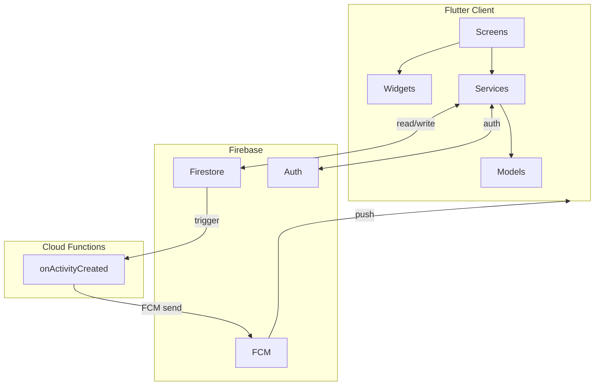
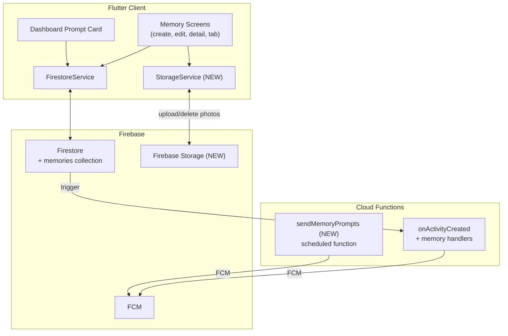
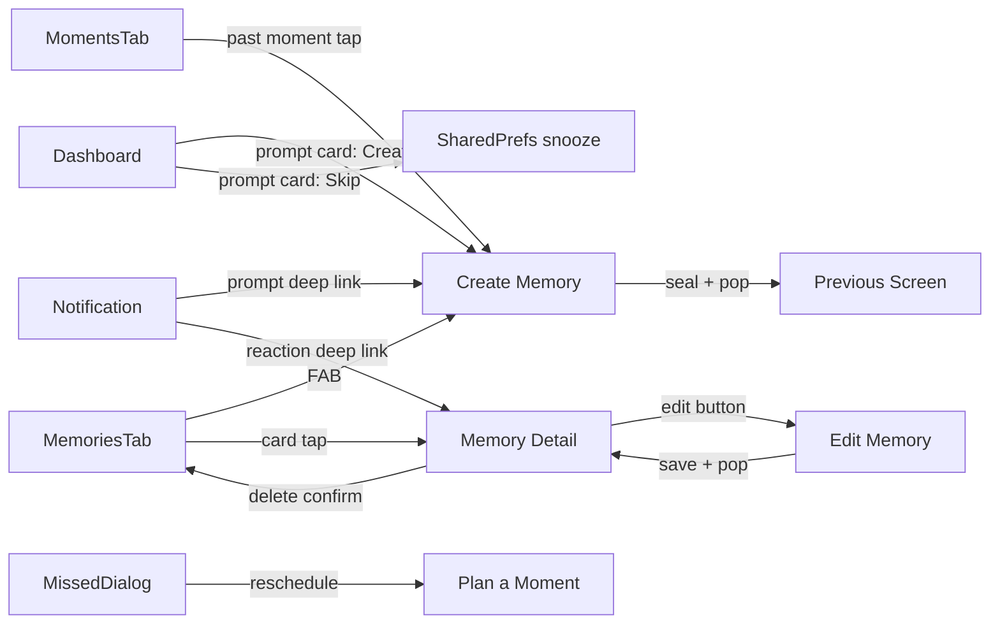

# TDD-001: Memories — Technical Design Document

| Field            | Value                                      |
|------------------|--------------------------------------------|
| **Document ID**  | TDD-001                                    |
| **Feature**      | Memories                                   |
| **PRD**          | PRD-001 (v0.3)                             |
| **Author**       | Engineering                                |
| **Status**       | Draft                                      |
| **Created**      | 2026-03-12                                 |
| **Last Updated** | 2026-03-13                                 |

---

## Table of Contents

1. [Overview](#1-overview)
2. [System Context](#2-system-context)
3. [Data Model](#3-data-model)
4. [Firestore Schema & Indexes](#4-firestore-schema--indexes)
5. [Firebase Storage](#5-firebase-storage)
6. [Security Rules](#6-security-rules)
7. [Service Layer](#7-service-layer)
8. [Screen Architecture](#8-screen-architecture)
9. [Widget Inventory](#9-widget-inventory)
10. [Navigation & Routing](#10-navigation--routing)
11. [Notification & Cloud Functions](#11-notification--cloud-functions)
12. [Scoring Engine Integration](#12-scoring-engine-integration)
13. [Activity Trail Integration](#13-activity-trail-integration)
14. [File Manifest](#14-file-manifest)
15. [Migration & Backward Compatibility](#15-migration--backward-compatibility)
16. [Testing Strategy](#16-testing-strategy)
17. [Implementation Order](#17-implementation-order)
18. [Decision Log](#18-decision-log)

---

## 1. Overview

This document defines the technical design for the Memories feature (PRD-001 v0.3). It maps every product requirement to concrete implementation details: data models, Firestore paths, service methods, screen widgets, routes, cloud functions, and security rules. All designs follow established codebase patterns documented in the project README and `.cursorrules`.

### Design Principles (Inherited)

1. **Simplicity First** — `setState` for local state, no state management libraries.
2. **Real-time by Default** — Firestore streams via `StreamSubscription` with `mounted` checks.
3. **DRY** — Reuse `ActiveCard`, `SlideToAction`, `VerticalBarSlider`, `PremiumCard`, `EmptyState`.
4. **UTC-First** — All dates stored as UTC midnight; local conversion in UI only.
5. **Centralized Theme** — `AppColors`, `AppTypography`, `AppSpacing` everywhere.

### Key Technical Decisions (Summary)

| Decision | Resolution |
|----------|------------|
| Seal atomicity | Firestore batch write for memory + moment status + activity |
| Photo storage | Store storage paths, resolve download URLs at read time |
| Photo compression | Client-side 1920px/80% JPEG + 300px thumbnails |
| Moment data on memory | Denormalize `momentName`, `momentType`, `momentDate` |
| Reactions storage | Inline map on memory doc with field-level security rules |
| Max per moment | 1 per user per moment; doc ID = `{momentId}_{userId}` |
| Edit concurrency | No optimistic locking; last write wins (single creator) |
| Snooze storage | SharedPreferences (local per-device) |
| `momentCompleted` | Deprecated; `memoryCreated` replaces it |

---

## 2. System Context

### Current Architecture



### Additions for Memories



**New infrastructure:**
- Firebase Storage for photo uploads (full-size + thumbnails).
- `StorageService` — new service class for upload/delete/URL resolution.
- `sendMemoryPrompts` — scheduled Cloud Function for memory prompt notifications.

---

## 3. Data Model

### 3.1 Memory Model

**File:** `lib/models/memory.dart` (new)

```dart
enum MomentStatus {
  planned('planned'),
  lived('lived'),
  missed('missed');

  const MomentStatus(this.value);
  final String value;

  static MomentStatus fromValue(String value) {
    return MomentStatus.values.firstWhere(
      (e) => e.value == value,
      orElse: () => MomentStatus.planned,
    );
  }
}

class Memory {
  const Memory({
    required this.id,
    required this.createdBy,
    required this.date,
    required this.createdAt,
    this.momentId,
    this.momentName,
    this.momentType,
    this.momentDate,
    this.title,
    this.photoPaths = const [],
    this.thumbPaths = const [],
    this.caption,
    this.place,
    this.music,
    this.checkinId,
    this.reactions = const {},
    this.updatedAt,
  });

  final String id;

  // Moment link (null for standalone)
  final String? momentId;
  final String? momentName;     // denormalized snapshot at seal time
  final String? momentType;     // "connect" | "celebrate" | "escape"
  final DateTime? momentDate;   // moment startDate snapshot

  // Standalone fields
  final String? title;          // standalone memories only (max 100 chars)

  // Content
  final String createdBy;
  final List<String> photoPaths;  // Firebase Storage paths (max 3)
  final List<String> thumbPaths;  // thumbnail Storage paths (max 3)
  final String? caption;          // max 280 chars
  final String? place;            // max 100 chars
  final String? music;            // max 100 chars
  final String? checkinId;        // linked UserCheckIn ID

  // Social
  final Map<String, String> reactions;  // userId → emoji

  // Timestamps
  final DateTime date;          // when the experience happened (UTC midnight)
  final DateTime createdAt;     // when sealed
  final DateTime? updatedAt;    // last edit timestamp, null if never edited

  // ---------------------------------------------------------------------------
  // Computed
  // ---------------------------------------------------------------------------

  bool get isStandalone => momentId == null;
  bool get hasPhotos => photoPaths.isNotEmpty;
  bool get hasCheckin => checkinId != null;
  bool get isEdited => updatedAt != null;
  String get displayTitle => isStandalone ? (title ?? '') : (momentName ?? '');

  // ---------------------------------------------------------------------------
  // Serialization
  // ---------------------------------------------------------------------------

  factory Memory.fromFirestore(DocumentSnapshot doc) {
    final data = doc.data()! as Map<String, dynamic>;
    return Memory.fromJson(doc.id, data);
  }

  factory Memory.fromJson(String id, Map<String, dynamic> json) {
    return Memory(
      id: id,
      momentId: json['momentId'] as String?,
      momentName: json['momentName'] as String?,
      momentType: json['momentType'] as String?,
      momentDate: json['momentDate'] != null
          ? (json['momentDate'] as Timestamp).toDate()
          : null,
      title: json['title'] as String?,
      createdBy: json['createdBy'] as String,
      photoPaths: List<String>.from(json['photoPaths'] ?? []),
      thumbPaths: List<String>.from(json['thumbPaths'] ?? []),
      caption: json['caption'] as String?,
      place: json['place'] as String?,
      music: json['music'] as String?,
      checkinId: json['checkinId'] as String?,
      reactions: Map<String, String>.from(json['reactions'] ?? {}),
      date: (json['date'] as Timestamp).toDate(),
      createdAt: (json['createdAt'] as Timestamp).toDate(),
      updatedAt: json['updatedAt'] != null
          ? (json['updatedAt'] as Timestamp).toDate()
          : null,
    );
  }

  Map<String, dynamic> toJson() {
    return {
      if (momentId != null) 'momentId': momentId,
      if (momentName != null) 'momentName': momentName,
      if (momentType != null) 'momentType': momentType,
      if (momentDate != null) 'momentDate': Timestamp.fromDate(momentDate!),
      if (title != null) 'title': title,
      'createdBy': createdBy,
      'photoPaths': photoPaths,
      'thumbPaths': thumbPaths,
      if (caption != null) 'caption': caption,
      if (place != null) 'place': place,
      if (music != null) 'music': music,
      if (checkinId != null) 'checkinId': checkinId,
      'reactions': reactions,
      'date': Timestamp.fromDate(date),
      'createdAt': FieldValue.serverTimestamp(),
    };
  }

  /// Produces update payload for edits (does NOT touch createdAt, createdBy, reactions, checkinId).
  Map<String, dynamic> toUpdateJson() {
    return {
      'photoPaths': photoPaths,
      'thumbPaths': thumbPaths,
      if (caption != null) 'caption': caption else 'caption': FieldValue.delete(),
      if (place != null) 'place': place else 'place': FieldValue.delete(),
      if (music != null) 'music': music else 'music': FieldValue.delete(),
      if (title != null) 'title': title,
      'updatedAt': FieldValue.serverTimestamp(),
    };
  }

  Memory copyWith({
    String? id,
    String? momentId,
    String? momentName,
    String? momentType,
    DateTime? momentDate,
    String? title,
    String? createdBy,
    List<String>? photoPaths,
    List<String>? thumbPaths,
    String? caption,
    String? place,
    String? music,
    String? checkinId,
    Map<String, String>? reactions,
    DateTime? date,
    DateTime? createdAt,
    DateTime? updatedAt,
  }) {
    return Memory(
      id: id ?? this.id,
      momentId: momentId ?? this.momentId,
      momentName: momentName ?? this.momentName,
      momentType: momentType ?? this.momentType,
      momentDate: momentDate ?? this.momentDate,
      title: title ?? this.title,
      createdBy: createdBy ?? this.createdBy,
      photoPaths: photoPaths ?? this.photoPaths,
      thumbPaths: thumbPaths ?? this.thumbPaths,
      caption: caption ?? this.caption,
      place: place ?? this.place,
      music: music ?? this.music,
      checkinId: checkinId ?? this.checkinId,
      reactions: reactions ?? this.reactions,
      date: date ?? this.date,
      createdAt: createdAt ?? this.createdAt,
      updatedAt: updatedAt ?? this.updatedAt,
    );
  }
}
```

**Pattern alignment:**
- Follows `Moment` model: `const` constructor, `fromFirestore` → `fromJson`, `toJson()`, `copyWith`.
- Enum uses `.value` string with `fromValue` and `orElse` fallback (same as `MomentType`, `TimeSlot`).
- Dates stored as `Timestamp`, normalized to UTC midnight.
- `createdAt` uses `FieldValue.serverTimestamp()` on write (same as `Moment.createdAt`).
- `toUpdateJson()` is a separate method for edits — it never touches `createdAt`, `createdBy`, `reactions`, or `checkinId`.

### 3.2 Moment Model Update

**File:** `lib/models/moment.dart` (modified)

Add `MomentStatus` enum (defined in `memory.dart`, imported here) and a `status` field:

```dart
class Moment {
  const Moment({
    // ... existing fields ...
    this.status = MomentStatus.planned,   // NEW
  });

  final MomentStatus status;              // NEW

  // fromJson: parse status with fallback
  // status: MomentStatus.fromValue(json['status'] as String? ?? 'planned')

  // toJson: include status
  // 'status': status.value,

  // copyWith: include status
}
```

**Backward compatibility:** Existing documents without `status` default to `planned` via `?? 'planned'` in `fromJson`.

### 3.3 Activity Model Update

**File:** `lib/models/activity.dart` (modified)

Add new enum values:

```dart
enum ActivityType {
  // ... existing values ...
  memoryCreated('memory_created', 'sealed a memory'),       // NEW
  memoryEdited('memory_edited', 'edited a memory'),         // NEW
  memoryDeleted('memory_deleted', 'removed a memory'),      // NEW
  memoryReaction('memory_reaction', 'reacted to a memory'), // NEW
  momentMissed('moment_missed', 'marked as missed'),        // NEW
}
```

Add to `EntityType`:

```dart
enum EntityType {
  checkin('checkin'),
  moment('moment'),
  space('space'),
  memory('memory'),       // NEW
}
```

**Note:** `ActivityType.momentCompleted` is deprecated. It remains in the enum for backward compatibility (old activity docs may reference it) but will not be triggered by new code. The Cloud Function notification template for `moment_completed` will be replaced with a deprecation comment.

### 3.4 Entity Relationship Diagram


---

## 4. Firestore Schema & Indexes

### 4.1 Collection Path

```
spaces/{spaceId}/memories/{memoryId}
```

**Document ID convention:**
- Moment-linked: `{momentId}_{userId}` — naturally enforces 1 per user per moment.
- Standalone: auto-generated via `.doc()`.

### 4.2 Document Shape

```json
{
  "momentId": "string | null",
  "momentName": "string | null",
  "momentType": "string | null",
  "momentDate": "Timestamp | null",
  "title": "string | null",
  "createdBy": "string",
  "photoPaths": ["path1", "path2"],
  "thumbPaths": ["thumb1", "thumb2"],
  "caption": "string | null",
  "place": "string | null",
  "music": "string | null",
  "checkinId": "string | null",
  "reactions": { "userId1": "❤️" },
  "date": "Timestamp",
  "createdAt": "Timestamp (server)",
  "updatedAt": "Timestamp (server) | null"
}
```

### 4.3 Required Indexes

| Collection | Fields | Order | Purpose |
|------------|--------|-------|---------|
| `memories` | `date` | DESC | Timeline sort (newest first) |
| `memories` | `momentId`, `createdAt` | ASC | Group memories by moment |
| `memories` | `createdBy`, `date` | DESC | User-specific queries (future) |

### 4.4 Updated Moment Document

Existing `moments/{momentId}` gains:

```json
{
  "status": "planned | lived | missed"
}
```

No index change needed — `status` is read inline, not queried standalone in V1.

---

## 5. Firebase Storage

### 5.1 Bucket Structure

```
spaces/{spaceId}/memories/{memoryId}/
  ├── photo_0.jpg            # Full-size (max 1920px, JPEG 80%)
  ├── photo_0_thumb.jpg      # Thumbnail (300px, JPEG 80%)
  ├── photo_1.jpg
  ├── photo_1_thumb.jpg
  └── ...
```

### 5.2 Upload Strategy

1. User picks images via `image_picker`.
2. For each image, client-side processing:
   a. Resize to max 1920px on longest edge, JPEG quality 80% → `photo_{i}.jpg` (~500 KB).
   b. Resize to 300px on longest edge, JPEG quality 80% → `photo_{i}_thumb.jpg` (~20 KB).
3. Upload both sizes sequentially to `spaces/{spaceId}/memories/{memoryId}/`.
4. **Storage paths** (not download URLs) are stored in `photoPaths` and `thumbPaths` arrays.
5. Download URLs are resolved on-demand via `StorageService.resolveUrl()` and cached client-side.

### 5.3 Constraints

| Constraint | Value | Enforced At |
|------------|-------|-------------|
| Max photos per memory | 3 | Client (UI) + doc ID convention |
| Max file size | 10 MB | Storage rules + client validation |
| Content type | `image/*` | Storage rules |
| Full-size target | ~500 KB (1920px, 80% JPEG) | Client (before upload) |
| Thumbnail target | ~20 KB (300px, 80% JPEG) | Client (before upload) |

### 5.4 StorageService

**File:** `lib/services/storage_service.dart` (new)

```dart
class StorageService {
  final _storage = FirebaseStorage.instance;

  /// URL cache: storage path → download URL.
  /// Avoids repeated getDownloadURL() calls for the same path.
  final _urlCache = <String, String>{};

  /// Resolves a storage path to a download URL, using cache.
  Future<String> resolveUrl(String storagePath) async {
    if (_urlCache.containsKey(storagePath)) return _urlCache[storagePath]!;
    final url = await _storage.ref(storagePath).getDownloadURL();
    _urlCache[storagePath] = url;
    return url;
  }

  /// Resolves multiple paths in parallel.
  Future<List<String>> resolveUrls(List<String> paths) async {
    return Future.wait(paths.map(resolveUrl));
  }

  /// Uploads full-size + thumbnail pairs. Returns (photoPaths, thumbPaths).
  Future<(List<String>, List<String>)> uploadMemoryPhotos({
    required String spaceId,
    required String memoryId,
    required List<File> fullPhotos,
    required List<File> thumbPhotos,
  }) async {
    final photoPaths = <String>[];
    final thumbPaths = <String>[];

    for (var i = 0; i < fullPhotos.length; i++) {
      final fullPath = 'spaces/$spaceId/memories/$memoryId/photo_$i.jpg';
      final thumbPath = 'spaces/$spaceId/memories/$memoryId/photo_${i}_thumb.jpg';

      await _storage.ref(fullPath).putFile(
        fullPhotos[i],
        SettableMetadata(contentType: 'image/jpeg'),
      );
      await _storage.ref(thumbPath).putFile(
        thumbPhotos[i],
        SettableMetadata(contentType: 'image/jpeg'),
      );

      photoPaths.add(fullPath);
      thumbPaths.add(thumbPath);
    }
    return (photoPaths, thumbPaths);
  }

  /// Deletes all photos under a memory folder.
  Future<void> deleteAllMemoryPhotos({
    required String spaceId,
    required String memoryId,
  }) async {
    final listResult = await _storage
        .ref('spaces/$spaceId/memories/$memoryId')
        .listAll();
    for (final item in listResult.items) {
      await item.delete();
    }
  }

  /// Deletes specific files by storage path.
  Future<void> deleteFiles(List<String> paths) async {
    for (final path in paths) {
      await _storage.ref(path).delete();
      _urlCache.remove(path);
    }
  }
}
```

---

## 6. Security Rules

### 6.1 Firestore Rules Addition

**File:** `firestore.rules` (modified)

Add inside the `match /spaces/{spaceId}` block, alongside existing `moments`, `checkins`, `activities`:

```javascript
match /memories/{memoryId} {
  // Any space member can read
  allow read: if request.auth != null
    && request.auth.uid in get(/databases/$(database)/documents/spaces/$(spaceId)).data.memberIds;

  // Only authenticated members can create; must set createdBy to own uid
  allow create: if request.auth != null
    && request.auth.uid in get(/databases/$(database)/documents/spaces/$(spaceId)).data.memberIds
    && request.resource.data.createdBy == request.auth.uid
    && request.resource.data.keys().hasAll(['createdBy', 'date', 'createdAt', 'photoPaths', 'thumbPaths', 'reactions']);

  // Update: creator can edit content fields, OR any member can update only their own reaction key
  allow update: if request.auth != null
    && request.auth.uid in get(/databases/$(database)/documents/spaces/$(spaceId)).data.memberIds
    && (
      // Case 1: Creator editing memory content
      request.auth.uid == resource.data.createdBy
      ||
      // Case 2: Any member updating only their own reaction
      (
        request.resource.data.diff(resource.data).affectedKeys().hasOnly(['reactions'])
        && request.resource.data.reactions.diff(resource.data.reactions).affectedKeys().hasOnly([request.auth.uid])
      )
    );

  // Only the creator can delete
  allow delete: if request.auth != null
    && request.auth.uid in get(/databases/$(database)/documents/spaces/$(spaceId)).data.memberIds
    && request.auth.uid == resource.data.createdBy;
}
```

**Key design decisions:**
- `create` validates `createdBy == auth.uid` (no impersonation).
- `create` validates required fields are present.
- `update` has two paths: creator can update anything; partner can only modify their own key within `reactions`.
- `delete` restricted to creator only.

### 6.2 Storage Rules

**File:** `storage.rules` (new or appended to existing)

```javascript
rules_version = '2';
service firebase.storage {
  match /b/{bucket}/o {
    match /spaces/{spaceId}/memories/{memoryId}/{fileName} {
      // Any space member can read photos
      allow read: if request.auth != null
        && firestore.get(/databases/(default)/documents/spaces/$(spaceId)).data.memberIds.hasAny([request.auth.uid]);

      // Any space member can upload (size + type constrained)
      allow write: if request.auth != null
        && firestore.get(/databases/(default)/documents/spaces/$(spaceId)).data.memberIds.hasAny([request.auth.uid])
        && request.resource.size < 10 * 1024 * 1024
        && request.resource.contentType.matches('image/.*');

      // Any space member can delete (needed for edit + delete flows)
      allow delete: if request.auth != null
        && firestore.get(/databases/(default)/documents/spaces/$(spaceId)).data.memberIds.hasAny([request.auth.uid]);
    }
  }
}
```

**Note:** Storage `delete` is allowed for any member (not just creator) because Firestore rules already gate who can trigger the delete flow. The Storage path alone doesn't indicate ownership.

---

## 7. Service Layer

### 7.1 FirestoreService — Memory CRUD

**File:** `lib/services/firestore_service.dart` (modified)

```dart
// ---------------------------------------------------------------------------
// Memories
// ---------------------------------------------------------------------------

/// Generates a memory document ID.
/// Moment-linked: "{momentId}_{userId}" (enforces 1 per user per moment).
/// Standalone: auto-generated.
String generateMemoryId({
  required String spaceId,
  String? momentId,
  required String userId,
}) {
  if (momentId != null) {
    return '${momentId}_$userId';
  }
  return _firestore
      .collection('spaces').doc(spaceId)
      .collection('memories').doc().id;
}

/// Creates a memory + updates moment status + logs activity in a single batch.
/// Check-in (if any) must be submitted BEFORE calling this method.
Future<String> sealMemory({
  required String spaceId,
  required Memory memory,
  required String actorName,
}) async {
  final batch = _firestore.batch();

  // 1. Create memory document
  final memoryRef = _firestore
      .collection('spaces').doc(spaceId)
      .collection('memories').doc(memory.id);
  batch.set(memoryRef, memory.toJson());

  // 2. Update moment status to "lived" (if linked)
  if (memory.momentId != null) {
    final momentRef = _firestore
        .collection('spaces').doc(spaceId)
        .collection('moments').doc(memory.momentId);
    batch.update(momentRef, {'status': MomentStatus.lived.value});
  }

  // 3. Log memoryCreated activity
  final activityRef = _firestore
      .collection('spaces').doc(spaceId)
      .collection('activities').doc();
  batch.set(activityRef, {
    'type': ActivityType.memoryCreated.value,
    'actorId': memory.createdBy,
    'actorName': actorName,
    'entityType': EntityType.memory.value,
    'entityId': memory.id,
    'timestamp': FieldValue.serverTimestamp(),
    'metadata': {
      'memoryTitle': memory.displayTitle,
      if (memory.momentId != null) 'momentId': memory.momentId,
    },
  });

  await batch.commit();
  return memory.id;
}

/// Updates a memory's content fields. Creator-only operation.
Future<void> updateMemory({
  required String spaceId,
  required Memory updatedMemory,
  required List<String> editedFields,
  required String actorName,
}) async {
  final batch = _firestore.batch();

  // 1. Update memory document
  final memoryRef = _firestore
      .collection('spaces').doc(spaceId)
      .collection('memories').doc(updatedMemory.id);
  batch.update(memoryRef, updatedMemory.toUpdateJson());

  // 2. Log memoryEdited activity
  final activityRef = _firestore
      .collection('spaces').doc(spaceId)
      .collection('activities').doc();
  batch.set(activityRef, {
    'type': ActivityType.memoryEdited.value,
    'actorId': updatedMemory.createdBy,
    'actorName': actorName,
    'entityType': EntityType.memory.value,
    'entityId': updatedMemory.id,
    'timestamp': FieldValue.serverTimestamp(),
    'metadata': {
      'memoryTitle': updatedMemory.displayTitle,
      if (updatedMemory.momentId != null) 'momentId': updatedMemory.momentId,
      'editedFields': editedFields,
    },
  });

  await batch.commit();
}

/// Deletes a memory. If it was the last memory on a moment, reverts moment
/// status to "planned". Uses a transaction for atomic read-then-write.
Future<void> deleteMemory({
  required String spaceId,
  required Memory memory,
  required String actorName,
}) async {
  await _firestore.runTransaction((txn) async {
    final memoryRef = _firestore
        .collection('spaces').doc(spaceId)
        .collection('memories').doc(memory.id);

    // If moment-linked, check if this is the last memory for that moment
    if (memory.momentId != null) {
      final otherMemories = await _firestore
          .collection('spaces').doc(spaceId)
          .collection('memories')
          .where('momentId', isEqualTo: memory.momentId)
          .get();

      final isLastMemory = otherMemories.docs
          .where((d) => d.id != memory.id)
          .isEmpty;

      if (isLastMemory) {
        final momentRef = _firestore
            .collection('spaces').doc(spaceId)
            .collection('moments').doc(memory.momentId);
        txn.update(momentRef, {'status': MomentStatus.planned.value});
      }
    }

    txn.delete(memoryRef);
  });

  // Log activity outside transaction (fire-and-forget)
  await logActivity(
    spaceId: spaceId,
    type: ActivityType.memoryDeleted,
    actorId: memory.createdBy,
    actorName: actorName,
    entityType: EntityType.memory,
    entityId: memory.id,
    metadata: {
      'memoryTitle': memory.displayTitle,
      if (memory.momentId != null) 'momentId': memory.momentId,
    },
  );
}

/// Adds or updates a reaction on a memory.
Future<void> setReaction({
  required String spaceId,
  required String memoryId,
  required String userId,
  required String emoji,
}) async {
  await _firestore
      .collection('spaces').doc(spaceId)
      .collection('memories').doc(memoryId)
      .update({'reactions.$userId': emoji});
}

/// Removes a reaction from a memory.
Future<void> removeReaction({
  required String spaceId,
  required String memoryId,
  required String userId,
}) async {
  await _firestore
      .collection('spaces').doc(spaceId)
      .collection('memories').doc(memoryId)
      .update({'reactions.$userId': FieldValue.delete()});
}

/// Watches all memories in a space, ordered by date descending.
Stream<List<Memory>> watchMemories(String spaceId) {
  return _firestore
      .collection('spaces').doc(spaceId)
      .collection('memories')
      .orderBy('date', descending: true)
      .snapshots()
      .map((snap) => snap.docs
          .map((doc) => Memory.fromFirestore(doc))
          .toList());
}

/// Watches a single memory document.
Stream<Memory?> watchMemory(String spaceId, String memoryId) {
  return _firestore
      .collection('spaces').doc(spaceId)
      .collection('memories').doc(memoryId)
      .snapshots()
      .map((doc) => doc.exists ? Memory.fromFirestore(doc) : null);
}

/// Fetches memories for a specific moment.
Future<List<Memory>> getMemoriesForMoment({
  required String spaceId,
  required String momentId,
}) async {
  final snap = await _firestore
      .collection('spaces').doc(spaceId)
      .collection('memories')
      .where('momentId', isEqualTo: momentId)
      .orderBy('createdAt')
      .get();
  return snap.docs.map((doc) => Memory.fromFirestore(doc)).toList();
}

/// Gets a single memory by ID.
Future<Memory?> getMemory({
  required String spaceId,
  required String memoryId,
}) async {
  final doc = await _firestore
      .collection('spaces').doc(spaceId)
      .collection('memories').doc(memoryId)
      .get();
  return doc.exists ? Memory.fromFirestore(doc) : null;
}
```

### 7.2 FirestoreService — Prompting Queries

```dart
/// Gets past moments awaiting memory (status == planned, ended within 14 days).
/// Used by the dashboard prompt card.
Future<List<Moment>> getPastMomentsAwaitingMemory(String spaceId) async {
  final snap = await _firestore
      .collection('spaces').doc(spaceId)
      .collection('moments')
      .where('status', isEqualTo: 'planned')
      .get();

  final now = DateTime.now().toUtc();
  final today = DateTime.utc(now.year, now.month, now.day);
  final cutoff = today.subtract(const Duration(days: 14));

  return snap.docs
      .map((doc) => Moment.fromFirestore(doc))
      .where((m) {
        final end = m.endDate ?? m.startDate;
        return end.isBefore(today) && end.isAfter(cutoff);
      })
      .toList()
    ..sort((a, b) => (b.endDate ?? b.startDate)
        .compareTo(a.endDate ?? a.startDate));
}

/// Updates a moment's status field.
Future<void> updateMomentStatus({
  required String spaceId,
  required String momentId,
  required MomentStatus status,
}) async {
  await _firestore
      .collection('spaces').doc(spaceId)
      .collection('moments').doc(momentId)
      .update({'status': status.value});
}
```

### 7.3 Activity Logging Methods

```dart
Future<void> logMemoryReactionActivity({
  required String spaceId,
  required String userId,
  required String userName,
  required String memoryId,
  required String memoryTitle,
  required String emoji,
}) async {
  await logActivity(
    spaceId: spaceId,
    type: ActivityType.memoryReaction,
    actorId: userId,
    actorName: userName,
    entityType: EntityType.memory,
    entityId: memoryId,
    metadata: {
      'memoryTitle': memoryTitle,
      'emoji': emoji,
    },
  );
}

Future<void> logMomentMissedActivity({
  required String spaceId,
  required String userId,
  required String userName,
  required String momentId,
  required String momentName,
  required String momentType,
  required bool rescheduled,
}) async {
  await logActivity(
    spaceId: spaceId,
    type: ActivityType.momentMissed,
    actorId: userId,
    actorName: userName,
    entityType: EntityType.moment,
    entityId: momentId,
    metadata: {
      'momentName': momentName,
      'momentType': momentType,
      'rescheduled': rescheduled,
    },
  );
}
```

---

## 8. Screen Architecture

### 8.1 Screen Inventory

| Screen | File | Type | Purpose |
|--------|------|------|---------|
| `MemoriesTab` | `lib/screens/memories/memories_tab.dart` | StatefulWidget | Timeline showcase (3rd tab) |
| `CreateMemoryScreen` | `lib/screens/memory/create_memory_screen.dart` | StatefulWidget | Memory creation flow |
| `EditMemoryScreen` | `lib/screens/memory/edit_memory_screen.dart` | StatefulWidget | Edit memory (creator only) |
| `MemoryDetailSheet` | `lib/screens/memory/memory_detail_sheet.dart` | Function (showModalBottomSheet) | Detail view with reactions, edit/delete |
| `MemoryPromptCard` | `lib/screens/dashboard/widgets/memory_prompt_card.dart` | StatelessWidget | Dashboard prompt (Lived it / Missed it) |
| `MemoryDetailPage` | `lib/screens/memory/memory_detail_page.dart` | StatefulWidget | Route target for deep links; loads memory by ID, opens detail sheet |

### 8.2 CreateMemoryScreen — Detailed Design

**Pattern:** Mirrors `PlanMomentScreen` — single scrollable view with `SlideToAction` bottom bar.

```dart
class CreateMemoryScreen extends StatefulWidget {
  const CreateMemoryScreen({
    super.key,
    required this.spaceId,
    this.moment,          // non-null when creating from a lived moment
  });

  final String spaceId;
  final Moment? moment;   // pre-fill context
}

class _CreateMemoryScreenState extends State<CreateMemoryScreen> {
  // ---------------------------------------------------------------------------
  // Services
  // ---------------------------------------------------------------------------
  final _firestoreService = FirestoreService();
  final _storageService = StorageService();
  final _authService = AuthService();

  // ---------------------------------------------------------------------------
  // State
  // ---------------------------------------------------------------------------

  // Content
  List<File> _photos = [];
  List<File> _thumbs = [];   // generated thumbnails
  final _captionController = TextEditingController();
  final _placeController = TextEditingController();
  final _musicController = TextEditingController();
  final _titleController = TextEditingController();    // standalone only
  DateTime? _date;                                      // standalone only

  // Pulse check-in (embedded)
  Map<String, double> _scores = {};
  PulseConfig? _pulseConfig;
  StreamSubscription? _configSub;
  bool _slidersInteracted = false;

  // UI
  bool _isSealing = false;

  // ---------------------------------------------------------------------------
  // Computed
  // ---------------------------------------------------------------------------

  bool get _isStandalone => widget.moment == null;
  bool get _canSeal => _isStandalone
      ? _titleController.text.trim().isNotEmpty && _date != null
      : true;
  String get _displayTitle => _isStandalone
      ? _titleController.text.trim()
      : widget.moment!.name;

  // ---------------------------------------------------------------------------
  // Lifecycle
  // ---------------------------------------------------------------------------

  @override
  void initState() {
    super.initState();
    _date = widget.moment?.startDate;
    _subscribeToPulseConfig();
  }

  @override
  void dispose() {
    _captionController.dispose();
    _placeController.dispose();
    _musicController.dispose();
    _titleController.dispose();
    _configSub?.cancel();
    super.dispose();
  }

  // ---------------------------------------------------------------------------
  // Actions
  // ---------------------------------------------------------------------------

  Future<void> _pickPhotos() async {
    // image_picker, max 3. After picking, generate thumbnail via flutter_image_compress.
    // Store results in _photos (full) and _thumbs (300px).
  }

  void _removePhoto(int index) {
    setState(() {
      _photos.removeAt(index);
      _thumbs.removeAt(index);
    });
  }

  Future<void> _seal() async {
    if (_isSealing || !_canSeal) return;
    FocusScope.of(context).unfocus();
    setState(() => _isSealing = true);

    try {
      final userId = _authService.currentUser!.uid;
      final memoryId = _firestoreService.generateMemoryId(
        spaceId: widget.spaceId,
        momentId: widget.moment?.id,
        userId: userId,
      );

      // Step 1: Upload photos (before batch — Storage is not transactional)
      var photoPaths = <String>[];
      var thumbPaths = <String>[];
      if (_photos.isNotEmpty) {
        (photoPaths, thumbPaths) = await _storageService.uploadMemoryPhotos(
          spaceId: widget.spaceId,
          memoryId: memoryId,
          fullPhotos: _photos,
          thumbPhotos: _thumbs,
        );
      }

      // Step 2: Submit embedded check-in (if sliders were touched)
      String? checkinId;
      if (_slidersInteracted && _pulseConfig != null) {
        final intScores = _scores.map((k, v) => MapEntry(k, v.round()));
        checkinId = await _firestoreService.submitCheckIn(
          spaceId: widget.spaceId,
          userId: userId,
          scores: intScores,
          configSnapshot: _pulseConfig!.toConfigSnapshot(userId),
          notes: '',
          source: 'memory',
        );
      }

      // Step 3: Atomic batch — memory doc + moment status + activity
      final memory = Memory(
        id: memoryId,
        createdBy: userId,
        date: _date!,
        createdAt: DateTime.now(), // placeholder; server timestamp in toJson
        momentId: widget.moment?.id,
        momentName: widget.moment?.name,
        momentType: widget.moment?.type.value,
        momentDate: widget.moment?.startDate,
        title: _isStandalone ? _titleController.text.trim() : null,
        photoPaths: photoPaths,
        thumbPaths: thumbPaths,
        caption: _captionController.text.trim().isEmpty
            ? null : _captionController.text.trim(),
        place: _placeController.text.trim().isEmpty
            ? null : _placeController.text.trim(),
        music: _musicController.text.trim().isEmpty
            ? null : _musicController.text.trim(),
        checkinId: checkinId,
      );

      await _firestoreService.sealMemory(
        spaceId: widget.spaceId,
        memory: memory,
        actorName: /* from user doc or auth displayName */,
      );

      HapticFeedback.heavyImpact();
      if (mounted) context.pop();
    } catch (e) {
      if (mounted) {
        ScaffoldMessenger.of(context).showSnackBar(
          SnackBar(content: Text('Error: $e'), backgroundColor: AppColors.error),
        );
      }
    } finally {
      if (mounted) setState(() => _isSealing = false);
    }
  }

  // ---------------------------------------------------------------------------
  // Build
  // ---------------------------------------------------------------------------

  @override
  Widget build(BuildContext context) { /* ... */ }

  Widget _buildHeader() { /* moment name + date OR title field + date picker */ }
  Widget _buildPhotoSection() { /* PhotoPickerGrid */ }
  Widget _buildCaptionField() { /* ActiveCard with text field, 280 char counter */ }
  Widget _buildPlaceField() { /* ActiveCard with text field */ }
  Widget _buildMusicField() { /* ActiveCard with text field */ }
  Widget _buildPulseSection() { /* embedded VerticalBarSlider set */ }
  Widget _buildStickyBottom() { /* SlideToAction "Seal this memory" */ }
}
```

**Key design notes:**
- `moment` parameter is nullable: non-null = from-moment, null = standalone.
- Photos are `File` objects until seal, then uploaded. Thumbnails generated at pick time.
- Pulse sliders only create a `UserCheckIn` if interacted with (`_slidersInteracted` flag).
- The seal pipeline: upload photos → submit check-in → batch write (memory + status + activity) → pop.
- The batch write ensures memory doc, moment status, and activity are atomic.

### 8.3 EditMemoryScreen — Detailed Design

**Pattern:** Mirrors `CreateMemoryScreen` layout but pre-filled with existing memory data.

```dart
class EditMemoryScreen extends StatefulWidget {
  const EditMemoryScreen({
    super.key,
    required this.spaceId,
    required this.memory,
  });

  final String spaceId;
  final Memory memory;
}

class _EditMemoryScreenState extends State<EditMemoryScreen> {
  // ---------------------------------------------------------------------------
  // Services
  // ---------------------------------------------------------------------------
  final _firestoreService = FirestoreService();
  final _storageService = StorageService();

  // ---------------------------------------------------------------------------
  // State
  // ---------------------------------------------------------------------------

  // Existing photos (storage paths) that the user hasn't removed
  List<String> _existingPhotoPaths = [];
  List<String> _existingThumbPaths = [];

  // New photos picked during this edit session
  List<File> _newPhotos = [];
  List<File> _newThumbs = [];

  // Text controllers pre-filled from memory
  late final _captionController = TextEditingController(text: widget.memory.caption ?? '');
  late final _placeController = TextEditingController(text: widget.memory.place ?? '');
  late final _musicController = TextEditingController(text: widget.memory.music ?? '');
  late final _titleController = TextEditingController(text: widget.memory.title ?? '');

  // Pulse check-in: read-only display (FR-5.9.4)
  // Loaded from UserCheckIn if memory.checkinId != null

  bool _isSaving = false;

  // ---------------------------------------------------------------------------
  // Computed
  // ---------------------------------------------------------------------------

  int get _totalPhotoCount => _existingPhotoPaths.length + _newPhotos.length;
  bool get _canAddPhotos => _totalPhotoCount < 3;

  List<String> get _editedFields {
    final fields = <String>[];
    if (_captionController.text.trim() != (widget.memory.caption ?? '')) fields.add('caption');
    if (_placeController.text.trim() != (widget.memory.place ?? '')) fields.add('place');
    if (_musicController.text.trim() != (widget.memory.music ?? '')) fields.add('music');
    if (_titleController.text.trim() != (widget.memory.title ?? '')) fields.add('title');
    if (_existingPhotoPaths.length != widget.memory.photoPaths.length ||
        _newPhotos.isNotEmpty) fields.add('photos');
    return fields;
  }

  // ---------------------------------------------------------------------------
  // Lifecycle
  // ---------------------------------------------------------------------------

  @override
  void initState() {
    super.initState();
    _existingPhotoPaths = List.from(widget.memory.photoPaths);
    _existingThumbPaths = List.from(widget.memory.thumbPaths);
  }

  @override
  void dispose() {
    _captionController.dispose();
    _placeController.dispose();
    _musicController.dispose();
    _titleController.dispose();
    super.dispose();
  }

  // ---------------------------------------------------------------------------
  // Actions
  // ---------------------------------------------------------------------------

  void _removeExistingPhoto(int index) {
    setState(() {
      _existingPhotoPaths.removeAt(index);
      _existingThumbPaths.removeAt(index);
    });
  }

  void _removeNewPhoto(int index) {
    setState(() {
      _newPhotos.removeAt(index);
      _newThumbs.removeAt(index);
    });
  }

  Future<void> _save() async {
    if (_isSaving) return;
    FocusScope.of(context).unfocus();
    setState(() => _isSaving = true);

    try {
      // 1. Delete removed photos from Storage
      final removedPaths = widget.memory.photoPaths
          .where((p) => !_existingPhotoPaths.contains(p))
          .toList();
      final removedThumbPaths = widget.memory.thumbPaths
          .where((p) => !_existingThumbPaths.contains(p))
          .toList();
      if (removedPaths.isNotEmpty) {
        await _storageService.deleteFiles([...removedPaths, ...removedThumbPaths]);
      }

      // 2. Upload new photos
      var newPhotoPaths = <String>[];
      var newThumbPaths = <String>[];
      if (_newPhotos.isNotEmpty) {
        final startIndex = _existingPhotoPaths.length;
        (newPhotoPaths, newThumbPaths) = await _storageService.uploadMemoryPhotos(
          spaceId: widget.spaceId,
          memoryId: widget.memory.id,
          fullPhotos: _newPhotos,
          thumbPhotos: _newThumbs,
          // NOTE: index offset needed to avoid filename collisions
        );
      }

      // 3. Build updated memory
      final updatedMemory = widget.memory.copyWith(
        photoPaths: [..._existingPhotoPaths, ...newPhotoPaths],
        thumbPaths: [..._existingThumbPaths, ...newThumbPaths],
        caption: _captionController.text.trim().isEmpty
            ? null : _captionController.text.trim(),
        place: _placeController.text.trim().isEmpty
            ? null : _placeController.text.trim(),
        music: _musicController.text.trim().isEmpty
            ? null : _musicController.text.trim(),
        title: widget.memory.isStandalone ? _titleController.text.trim() : null,
      );

      // 4. Batch update memory + log activity
      await _firestoreService.updateMemory(
        spaceId: widget.spaceId,
        updatedMemory: updatedMemory,
        editedFields: _editedFields,
        actorName: /* from user doc */,
      );

      HapticFeedback.mediumImpact();
      if (mounted) context.pop();
    } catch (e) {
      if (mounted) {
        ScaffoldMessenger.of(context).showSnackBar(
          SnackBar(content: Text('Error: $e'), backgroundColor: AppColors.error),
        );
      }
    } finally {
      if (mounted) setState(() => _isSaving = false);
    }
  }

  // ---------------------------------------------------------------------------
  // Build
  // ---------------------------------------------------------------------------

  @override
  Widget build(BuildContext context) { /* Same layout as Create, pre-filled */ }
  // Pulse section: read-only sliders showing check-in scores (not editable)
  // SlideToAction label: "Save changes"
}
```

### 8.4 MemoriesTab — Timeline

**Pattern:** Mirrors `MomentsTab` — stream subscription, `mounted` checks, card-based layout.

```dart
class MemoriesTab extends StatefulWidget {
  const MemoriesTab({super.key, required this.spaceId});
  final String spaceId;
}

class _MemoriesTabState extends State<MemoriesTab> {
  final _firestoreService = FirestoreService();
  final _storageService = StorageService();

  StreamSubscription? _memoriesSub;
  List<Memory> _allMemories = [];
  bool _isLoading = true;

  // Thumbnail URL cache (resolved from thumbPaths)
  final _thumbUrls = <String, String>{};

  /// Groups memories: moment-linked grouped by momentId, standalone as individual items.
  /// Returns a list of display items in timeline order (newest date first).
  List<_TimelineItem> get _timelineItems {
    final momentGroups = <String, List<Memory>>{};
    final standalones = <Memory>[];

    for (final m in _allMemories) {
      if (m.momentId != null) {
        momentGroups.putIfAbsent(m.momentId!, () => []).add(m);
      } else {
        standalones.add(m);
      }
    }

    // Build timeline items sorted by date descending
    final items = <_TimelineItem>[];
    for (final entry in momentGroups.entries) {
      final group = entry.value..sort((a, b) => a.createdAt.compareTo(b.createdAt));
      final groupDate = group.first.date;
      items.add(_TimelineItem.momentGroup(
        momentId: entry.key,
        momentName: group.first.momentName ?? '',
        momentType: group.first.momentType,
        date: groupDate,
        memories: group,
      ));
    }
    for (final m in standalones) {
      items.add(_TimelineItem.standalone(memory: m));
    }
    items.sort((a, b) => b.date.compareTo(a.date));
    return items;
  }

  @override
  void initState() {
    super.initState();
    _subscribe();
  }

  void _subscribe() {
    _memoriesSub = _firestoreService
        .watchMemories(widget.spaceId)
        .listen((memories) {
      if (!mounted) return;
      setState(() {
        _allMemories = memories;
        _isLoading = false;
      });
    });
  }

  @override
  void dispose() {
    _memoriesSub?.cancel();
    super.dispose();
  }

  @override
  Widget build(BuildContext context) {
    if (_isLoading) return /* loading */;
    if (_allMemories.isEmpty) return _buildEmptyState();
    return _buildTimeline();
  }

  Widget _buildTimeline() { /* ListView with _timelineItems */ }
  Widget _buildMomentGroup(_TimelineItem group) { /* MomentGroupHeader + MemoryCard list */ }
  Widget _buildMemoryCard(Memory memory) { /* thumb strip, caption, tags, reaction badge */ }
  Widget _buildEmptyState() { /* EmptyState widget + CTA if past moments exist */ }
  Widget _buildFab() { /* FAB for standalone memory creation */ }
}
```

### 8.5 MemoryPromptCard — Dashboard

**Pattern:** Simple binary choice card.

```dart
class MemoryPromptCard extends StatelessWidget {
  const MemoryPromptCard({
    super.key,
    required this.moment,
    required this.onLived,
    required this.onMissed,
  });

  final Moment moment;
  final VoidCallback onLived;
  final VoidCallback onMissed;
}
```

**Layout:**
- Card label: "HOW WAS IT?" (uppercase, `GoogleFonts.outfit`, `AppColors.accentRed`)
- Moment type icon + moment name + formatted date
- Two CTAs: "Lived it" (primary, red tint) | "Missed it" (secondary, muted)

**Dashboard integration:**
- `_onLivedMoment`: marks moment status → `lived`, navigates to `/memory/:spaceId/create` with moment
- `_onMissedMoment`: marks moment status → `missed`, logs `momentMissed` activity, reloads prompt
- No snooze, no dialog — binary choice resolves the moment immediately
- Card positioned below the main grid, above Activity Trail

### 8.6 MemoryDetailSheet

**Pattern:** Mirrors `MomentDetailsSheet` — `showModalBottomSheet` with `DraggableScrollableSheet`.

Content sections:
1. **Header**: title/moment name + date + creator name + "Edited" badge if `updatedAt != null`
2. **Photo carousel**: horizontal scroll of full-size images (resolved from `photoPaths`)
3. **Caption text**
4. **Place tag** (if present): location pin icon + text
5. **Music tag** (if present): music note icon + text
6. **Pulse summary** (if `checkinId` present): load `UserCheckIn`, display attribute scores as colored bars
7. **Reaction display**: partner's emoji + name (if present)
8. **Reaction button**: opens `EmojiReactionPicker` for the partner to react
9. **Action buttons** (visible only to creator):
   - Edit icon → navigates to `EditMemoryScreen`
   - Delete icon → shows confirmation dialog, triggers delete flow

**Reaction interaction:**

```dart
Future<void> _toggleReaction(String emoji) async {
  final userId = _authService.currentUser!.uid;
  final currentReaction = memory.reactions[userId];

  if (currentReaction == emoji) {
    // Toggle off
    await _firestoreService.removeReaction(
      spaceId: widget.spaceId,
      memoryId: memory.id,
      userId: userId,
    );
  } else {
    // Set or replace
    await _firestoreService.setReaction(
      spaceId: widget.spaceId,
      memoryId: memory.id,
      userId: userId,
      emoji: emoji,
    );
    await _firestoreService.logMemoryReactionActivity(
      spaceId: widget.spaceId,
      userId: userId,
      userName: /* user name */,
      memoryId: memory.id,
      memoryTitle: memory.displayTitle,
      emoji: emoji,
    );
  }
  HapticFeedback.lightImpact();
}
```

**Delete flow:**

```dart
Future<void> _deleteMemory() async {
  final confirmed = await showDialog<bool>(
    context: context,
    builder: (_) => AlertDialog(
      title: Text('Delete this memory?'),
      content: Text('This will permanently remove this memory. This action cannot be undone.'),
      actions: [
        TextButton(onPressed: () => Navigator.pop(context, false), child: Text('Cancel')),
        TextButton(
          onPressed: () => Navigator.pop(context, true),
          style: TextButton.styleFrom(foregroundColor: AppColors.error),
          child: Text('Delete'),
        ),
      ],
    ),
  );
  if (confirmed != true || !mounted) return;

  // Delete photos from Storage
  await _storageService.deleteAllMemoryPhotos(
    spaceId: widget.spaceId,
    memoryId: memory.id,
  );

  // Delete memory doc + revert moment status if last
  await _firestoreService.deleteMemory(
    spaceId: widget.spaceId,
    memory: memory,
    actorName: /* user name */,
  );

  if (mounted) Navigator.pop(context); // close detail sheet
}
```

---

## 9. Widget Inventory

### 9.1 New Widgets

| Widget | File | Description |
|--------|------|-------------|
| `PhotoPickerGrid` | `lib/widgets/photo_picker_grid.dart` | 3-slot photo grid with add/remove. Shows existing (via thumbnail URLs) + new (via File). |
| `MemoryCard` | `lib/widgets/memory_card.dart` | Timeline card for a single memory. Shows thumbnail strip, caption snippet, place/music tags, reaction badge, creator, date. |
| `MomentGroupHeader` | `lib/widgets/moment_group_header.dart` | Header for grouped memories under a moment. Shows moment name, type icon, date. |
| `EmojiReactionPicker` | `lib/widgets/emoji_reaction_picker.dart` | Small horizontal emoji selector (6 curated emojis). Tap to select, tap again to deselect. |

### 9.2 Reused Widgets

| Widget | Source | Usage in Memories |
|--------|--------|-------------------|
| `ActiveCard` | `widgets/active_card.dart` | Section cards in creation/edit flow |
| `SlideToAction` | `widgets/slide_to_action.dart` | "Seal this memory" / "Save changes" |
| `VerticalBarSlider` | `widgets/dotted_slider.dart` | Embedded pulse check-in (create), read-only display (edit, detail) |
| `PremiumCard` | `widgets/neumorphic_container.dart` | Memory cards in timeline |
| `EmptyState` | `widgets/neumorphic_container.dart` | Empty memories tab |
| `SectionHeader` | `widgets/neumorphic_container.dart` | Section headers |
| `getMomentTypeIconWidget` | `widgets/moment_type_icon.dart` | Moment type icon on grouped headers |
| `AppDateCalendar` | `widgets/app_calendar.dart` | Date picker in standalone creation |

### 9.3 Barrel Export Update

**File:** `lib/widgets/widgets.dart` (modified)

Add:
```dart
export 'photo_picker_grid.dart';
export 'memory_card.dart';
export 'moment_group_header.dart';
export 'emoji_reaction_picker.dart';
```

---

## 10. Navigation & Routing

### 10.1 New Routes

**File:** `lib/router/app_router.dart` (modified)

```dart
// Create memory
GoRoute(
  path: '/memory/:spaceId/create',
  name: 'createMemory',
  pageBuilder: (context, state) {
    final spaceId = state.pathParameters['spaceId']!;
    final moment = state.extra as Moment?;
    return _slideTransition(
      state,
      CreateMemoryScreen(spaceId: spaceId, moment: moment),
    );
  },
),

// Memory detail (full-screen or bottom sheet trigger)
GoRoute(
  path: '/memory/:spaceId/:memoryId',
  name: 'memoryDetail',
  pageBuilder: (context, state) {
    final spaceId = state.pathParameters['spaceId']!;
    final memoryId = state.pathParameters['memoryId']!;
    return _fadeTransition(
      state,
      MemoryDetailPage(spaceId: spaceId, memoryId: memoryId),
    );
  },
),

// Edit memory
GoRoute(
  path: '/memory/:spaceId/:memoryId/edit',
  name: 'editMemory',
  pageBuilder: (context, state) {
    final spaceId = state.pathParameters['spaceId']!;
    final memory = state.extra as Memory;
    return _slideUpTransition(
      state,
      EditMemoryScreen(spaceId: spaceId, memory: memory),
    );
  },
),
```

### 10.2 Navigation Map



### 10.3 Tab Index Update

**File:** `lib/screens/main_shell.dart` (modified)

```
Tab 0: Dashboard        (slot 0)
Tab 1: Moments          (slot 1)
Tab 2: Memories          (slot 2)
Tab 3: Coming Soon       (slots 3-4)
```

The stretchy nav bar has 5 visual slots mapped to 4 logical tabs. Memories gets its own slot (2) with `Icons.auto_stories_rounded`. Coming Soon retains slots 3-4 with `Icons.hardware_rounded`.

Key changes in `_MainShellState`:
- 4 tabs: `DashboardTab`, `MomentsTab`, `MemoriesTab`, `_ComingSoonPage`
- `_slotToTab`: slot >= 3 → tab 3 (was: slot >= 2 → tab 2)
- App bar title: "Memories" when `_selectedTab == 2` (Cormorant Garamond, accentRed)
- App bar action: `+` button on tab 2 for standalone memory creation (matches Moments tab pattern)

---

## 11. Notification & Cloud Functions

### 11.1 Memory Prompt Notification (Scheduled)

**Approach:** A scheduled Cloud Function runs daily (e.g., 9 AM UTC) and queries for past moments awaiting memory.

**File:** `functions/src/index.ts` (modified)

```typescript
export const sendMemoryPrompts = onSchedule(
  { schedule: 'every day 09:00', timeZone: 'UTC' },
  async () => {
    const spacesSnap = await admin.firestore().collection('spaces').get();
    const now = admin.firestore.Timestamp.now();
    const todayMs = now.toMillis();
    const cutoffMs = todayMs - 14 * 24 * 60 * 60 * 1000; // 14-day cutoff

    for (const spaceDoc of spacesSnap.docs) {
      const momentsSnap = await spaceDoc.ref
        .collection('moments')
        .where('status', '==', 'planned')
        .get();

      for (const momentDoc of momentsSnap.docs) {
        const data = momentDoc.data();
        const endDate = data.endDate || data.startDate;
        const endMs = endDate.toMillis();

        // Must be past but within 14-day window
        if (endMs >= todayMs || endMs < cutoffMs) continue;

        // Send to both members
        const memberIds: string[] = spaceDoc.data().memberIds || [];
        for (const memberId of memberIds) {
          // Check notification preferences
          // Send FCM with data: { type: 'memory_prompt', spaceId, momentId }
        }
      }
    }
  }
);
```

### 11.2 Activity-Triggered Notifications

Add to existing `onActivityCreated` function's `buildNotificationContent`:

```typescript
case 'memory_created':
  return {
    title: `${activity.actorName} sealed a memory`,
    body: `for "${metadata.memoryTitle}"`,
  };

case 'memory_edited':
  return {
    title: `${activity.actorName} edited a memory`,
    body: `"${metadata.memoryTitle}"`,
  };

case 'memory_deleted':
  return {
    title: `${activity.actorName} removed a memory`,
    body: `"${metadata.memoryTitle}"`,
  };

case 'memory_reaction':
  return {
    title: `${activity.actorName} reacted to your memory`,
    body: `${metadata.emoji} on "${metadata.memoryTitle}"`,
  };

case 'moment_missed':
  return {
    title: `${activity.actorName} marked a moment as missed`,
    body: `"${metadata.momentName}"`,
  };

// Deprecate moment_completed (keep for old activities, no longer triggered)
case 'moment_completed':
  return {
    title: `${activity.actorName} completed a moment`,
    body: `"${metadata.momentName}"`,
  };
```

### 11.3 NotificationService Update

**File:** `lib/services/notification_service.dart` (modified)

Update `NotificationNavigation`:
```dart
bool get isMemoryPrompt => type == 'memory_prompt';
bool get isMemoryCreated => type == 'memory_created';
bool get isMemoryReaction => type == 'memory_reaction';
```

**File:** `lib/screens/main_shell.dart` (modified)

Handle new navigation types:
```dart
if (nav.isMemoryPrompt && nav.entityId != null) {
  final moment = await _firestoreService.getMoment(
    spaceId: widget.spaceId,
    momentId: nav.entityId!,
  );
  if (mounted && moment != null) {
    context.push('/memory/${widget.spaceId}/create', extra: moment);
  }
} else if (nav.isMemoryReaction && nav.entityId != null) {
  context.push('/memory/${widget.spaceId}/${nav.entityId}');
} else if (nav.isMemoryCreated && nav.entityId != null) {
  context.push('/memory/${widget.spaceId}/${nav.entityId}');
}
```

### 11.4 NotificationPreferences Update

**File:** `lib/models/notification_preferences.dart` (modified)

Add default configs for new activity types:
```dart
ActivityType.memoryCreated: ActivityNotificationConfig(
  activityType: ActivityType.memoryCreated,
  priority: NotificationPriority.normal,
),
ActivityType.memoryEdited: ActivityNotificationConfig(
  activityType: ActivityType.memoryEdited,
  priority: NotificationPriority.low,
),
ActivityType.memoryDeleted: ActivityNotificationConfig(
  activityType: ActivityType.memoryDeleted,
  priority: NotificationPriority.normal,
),
ActivityType.memoryReaction: ActivityNotificationConfig(
  activityType: ActivityType.memoryReaction,
  priority: NotificationPriority.low,
),
ActivityType.momentMissed: ActivityNotificationConfig(
  activityType: ActivityType.momentMissed,
  priority: NotificationPriority.low,
),
```

---

## 12. Scoring Engine Integration

The embedded pulse check-in in a memory creates a standard `UserCheckIn` document via the existing `submitCheckIn` method. This means:

- It flows through the existing scoring pipeline (`CheckInScoreSource` → `ScoreEngine`).
- It contributes to the 30-day health score window.
- It appears in `watchRecentCheckIns` alongside regular check-ins.
- No changes to `lib/scoring/` are needed.

**Source tagging:** The `submitCheckIn` call includes `source: 'memory'` in metadata. This is stored alongside the check-in for analytics purposes but does not affect scoring calculations.

The only consideration: the check-in's `timestamp` will be the memory creation time, not the moment's date. This is correct behavior — the check-in reflects how the user feels at reflection time.

---

## 13. Activity Trail Integration

### 13.1 Activity Types Display

**File:** `lib/screens/dashboard/widgets/activity_trail.dart` (modified)

| ActivityType | Icon | Color | Description Template | Navigable |
|-------------|------|-------|---------------------|-----------|
| `memoryCreated` | `Icons.auto_stories` | `AppColors.accentRed` | "{Actor} sealed a memory for **{memoryTitle}**" | Yes → memory detail |
| `memoryEdited` | `Icons.edit` | `AppColors.accentPurple` | "{Actor} edited a memory for **{memoryTitle}**" | Yes → memory detail |
| `memoryDeleted` | `Icons.delete_outline` | `AppColors.warmMuted` | "{Actor} removed a memory for **{memoryTitle}**" | No (deleted) |
| `memoryReaction` | `Icons.favorite` | `AppColors.accentRed` | "{Actor} reacted {emoji} to **{memoryTitle}**" | Yes → memory detail |
| `momentMissed` | `Icons.event_busy` | `AppColors.warmMuted` | "{Actor} marked **{momentName}** as missed" | No |

### 13.2 Navigation from Activity Trail

Update `openEntityById` in `DashboardTab` to handle memory entities:

```dart
case EntityType.memory:
  context.push('/memory/$spaceId/${activity.entityId}');
  break;
```

---

## 14. File Manifest

### 14.1 New Files

| File | Purpose |
|------|---------|
| `lib/models/memory.dart` | Memory model + MomentStatus enum |
| `lib/services/storage_service.dart` | Firebase Storage upload/delete/URL resolution with cache |
| `lib/screens/memory/create_memory_screen.dart` | Memory creation flow (from-moment + standalone) |
| `lib/screens/memory/edit_memory_screen.dart` | Edit memory (creator only) |
| `lib/screens/memory/memory_detail_sheet.dart` | Detail view with reactions, edit/delete |
| `lib/screens/memory/memory.dart` | Barrel export |
| `lib/screens/memories/memories_tab.dart` | Memories tab (timeline with grouping) |
| `lib/screens/dashboard/widgets/memory_prompt_card.dart` | Dashboard prompt (Create / Didn't happen / Skip) |
| `lib/widgets/photo_picker_grid.dart` | Photo selection grid (existing + new, max 3) |
| `lib/widgets/memory_card.dart` | Timeline memory card with thumbnail strip |
| `lib/widgets/moment_group_header.dart` | Grouped moment header for timeline |
| `lib/widgets/emoji_reaction_picker.dart` | Curated emoji selector (6 emojis) |
| `storage.rules` | Firebase Storage security rules |

### 14.2 Modified Files

| File | Changes |
|------|---------|
| `lib/models/moment.dart` | Add `status` field, import `MomentStatus` |
| `lib/models/activity.dart` | Add `memoryCreated`, `memoryEdited`, `memoryDeleted`, `memoryReaction`, `momentMissed` to `ActivityType`; add `memory` to `EntityType` |
| `lib/models/notification_preferences.dart` | Add default configs for 5 new activity types |
| `lib/services/firestore_service.dart` | Add `sealMemory`, `updateMemory`, `deleteMemory`, `setReaction`, `removeReaction`, `watchMemories`, `watchMemory`, `getMemory`, `getMemoriesForMoment`, `getPastMomentsAwaitingMemory`, `updateMomentStatus`, `generateMemoryId`, activity logging |
| `lib/services/notification_service.dart` | Add `isMemoryPrompt`, `isMemoryCreated`, `isMemoryReaction` to `NotificationNavigation` |
| `lib/screens/main_shell.dart` | Tab 2 → `MemoriesTab`, notification handling for memory prompts + reactions |
| `lib/screens/dashboard/dashboard_tab.dart` | Add `MemoryPromptCard` to layout, snooze check via SharedPreferences |
| `lib/screens/dashboard/widgets/activity_trail.dart` | Display 5 new activity types + memory entity navigation |
| `lib/router/app_router.dart` | Add `/memory/:spaceId/create`, `/memory/:spaceId/:memoryId`, `/memory/:spaceId/:memoryId/edit` routes |
| `lib/widgets/widgets.dart` | Export 4 new widgets |
| `firestore.rules` | Add `memories` collection rules (create/read/update/delete) |
| `functions/src/index.ts` | Add `sendMemoryPrompts` scheduled function; update `buildNotificationContent` for 5 new types; deprecate `moment_completed` |
| `pubspec.yaml` | Add `firebase_storage`, `image_picker`, `flutter_image_compress` |
| `README.md` | Document Memories feature, update feature list, tech stack, routes |

### 14.3 New Dependencies

| Package | Purpose |
|---------|---------|
| `firebase_storage` | Photo upload/download/delete |
| `image_picker` | Device gallery access |
| `flutter_image_compress` | Client-side image resize (native, fast) for full-size + thumbnail generation |

---

## 15. Migration & Backward Compatibility

### 15.1 Moment Status Field

Existing moment documents do not have a `status` field. The `fromJson` factory handles this:

```dart
status: MomentStatus.fromValue(json['status'] as String? ?? 'planned')
```

All existing moments are treated as `planned`. No Firestore migration script is needed.

**Prompt flooding prevention:** The 14-day cutoff (FR-5.7.1.4) ensures old past moments don't trigger prompt cards. Only moments whose end date is within 14 days of today appear in `getPastMomentsAwaitingMemory`. Users can still manually create memories for older moments via the Memories tab, but the app doesn't actively prompt.

### 15.2 Activity Type Enum

New enum values (`memoryCreated`, `memoryEdited`, `memoryDeleted`, `memoryReaction`, `momentMissed`) are additive. The existing `fromValue` pattern with `orElse` fallback ensures old clients won't crash on unknown activity types. Old clients will display unknown activities with a generic fallback.

### 15.3 `momentCompleted` Deprecation

`ActivityType.momentCompleted` remains in the enum but is no longer triggered by any code path. Existing activity documents with this type continue to render with their existing display logic. The Cloud Function notification case for `moment_completed` remains for old docs but includes a comment noting deprecation.

### 15.4 Cloud Functions

The `buildNotificationContent` switch statement needs `case` entries for new activity types. Missing cases fall through to a generic message (existing behavior).

The new `sendMemoryPrompts` scheduled function requires deploying with `firebase deploy --only functions`.

---

## 16. Testing Strategy

### 16.1 Unit Tests

| Test File | Scope |
|-----------|-------|
| `test/models/memory_test.dart` | `Memory.fromJson`, `toJson`, `toUpdateJson`, `copyWith`, computed properties, `MomentStatus` enum |
| `test/models/moment_status_test.dart` | Status field backward compatibility, enum round-trip, null → planned fallback |
| `test/services/firestore_service_memory_test.dart` | `sealMemory` batch, `updateMemory`, `deleteMemory` (with moment status revert), `setReaction`, `removeReaction`, `getPastMomentsAwaitingMemory` with 14-day cutoff |

### 16.2 Widget Tests

| Test File | Scope |
|-----------|-------|
| `test/screens/memory/create_memory_screen_test.dart` | Form validation, standalone vs from-moment mode, seal flow, pulse slider interaction detection |
| `test/screens/memory/edit_memory_screen_test.dart` | Pre-fill from memory, photo add/remove diff, save flow, read-only pulse display |
| `test/screens/memories/memories_tab_test.dart` | Timeline rendering, moment grouping, standalone display, empty state, FAB |
| `test/widgets/memory_prompt_card_test.dart` | Three CTAs (Create / Didn't happen / Skip), skip writes to SharedPreferences |
| `test/widgets/photo_picker_grid_test.dart` | Add/remove photos, max 3 limit, mixed existing + new photos |
| `test/widgets/emoji_reaction_picker_test.dart` | Select/deselect, 6 emoji options, toggle behavior |

### 16.3 Integration Tests

| Test | Scope |
|------|-------|
| Memory from moment E2E | Create moment → date passes → prompt → create memory → verify timeline + moment status = lived |
| Standalone memory E2E | Open memories tab → FAB → fill fields → seal → verify timeline |
| Missed moment E2E | Prompt → "Didn't happen" → reschedule / dismiss → verify status |
| Edit memory E2E | Create memory → open detail → edit → save → verify changes + "Edited" badge |
| Delete memory E2E | Create memory → open detail → delete → verify removed + moment status reverted |
| Reaction E2E | Partner A creates memory → Partner B opens detail → reacts → verify emoji displayed |
| Skip/Snooze E2E | Prompt → Skip → verify card hidden → verify reappears after 7 days |

### 16.4 Manual Test Checklist

- [ ] Create memory from dashboard prompt (all fields filled)
- [ ] Create memory with zero optional fields (just seal)
- [ ] Create standalone memory with title + date
- [ ] Photo upload: 1, 2, 3 photos; remove photo; large photo (>10MB rejected)
- [ ] Caption character limit (280)
- [ ] Pulse sliders: interact → check-in created with `source: 'memory'`; skip → no check-in
- [ ] Moment status transitions: planned → lived, planned → missed
- [ ] Missed moment reschedule flow
- [ ] Timeline display: single memory, grouped memories (2 partners), standalone
- [ ] Thumbnail images load on timeline cards (not full-size)
- [ ] Memory detail: all fields display, reaction button, edit/delete for creator
- [ ] Edit memory: change caption, add photo, remove photo, save → "Edited" badge appears
- [ ] Delete memory: confirm dialog → memory removed → moment status reverted if last
- [ ] Partner reaction: tap emoji → displayed on card and detail → notification sent
- [ ] Reaction toggle: tap same emoji removes it
- [ ] Skip prompt: card hidden → reappears after 7 days
- [ ] 14-day cutoff: moments older than 14 days don't show prompt cards
- [ ] Push notification: memory prompt tap opens creation screen
- [ ] Push notification: reaction tap opens memory detail
- [ ] Activity trail: all 5 new activity types display correctly with navigation
- [ ] Partner sees your memory in their timeline (real-time)
- [ ] Empty state on Memories tab with CTA if past moments exist
- [ ] 3-tab navigation works correctly
- [ ] Keyboard dismissal on all text fields
- [ ] Error handling: network failure during seal/save/delete
- [ ] `mounted` checks after all async operations
- [ ] 1 memory per user per moment enforced (creating second shows existing or blocked)

---

## 17. Implementation Order

A phased approach to enable incremental testing:

### Phase 1: Foundation (Data Layer)

1. Create `lib/models/memory.dart` (Memory model + MomentStatus enum)
2. Update `lib/models/moment.dart` (add `status` field)
3. Update `lib/models/activity.dart` (add 5 new enum values + `memory` entity type)
4. Update `firestore.rules` (add memories collection with create/read/update/delete)
5. Create `storage.rules`
6. Add `firebase_storage`, `image_picker`, `flutter_image_compress` to `pubspec.yaml`
7. Create `lib/services/storage_service.dart` (upload, delete, URL resolution with cache)
8. Add memory methods to `lib/services/firestore_service.dart` (`sealMemory`, `watchMemories`, `generateMemoryId`, etc.)
9. Write unit tests for models and service

### Phase 2: Creation Flow

10. Create `lib/widgets/photo_picker_grid.dart`
11. Create `lib/screens/memory/create_memory_screen.dart` (from-moment mode)
12. Add `/memory/:spaceId/create` route in `lib/router/app_router.dart`
13. Test creation flow end-to-end (manual)
14. Add standalone mode to `CreateMemoryScreen`
15. Write widget tests for creation screen

### Phase 3: Showcase (Timeline)

16. Create `lib/widgets/memory_card.dart` (with thumbnail URL resolution)
17. Create `lib/widgets/moment_group_header.dart`
18. Create `lib/screens/memories/memories_tab.dart` (timeline with grouping)
19. Update `lib/screens/main_shell.dart` (tab 2 → MemoriesTab)
20. Write widget tests for timeline

### Phase 4: Memory Detail + Reactions

21. Create `lib/widgets/emoji_reaction_picker.dart`
22. Create `lib/screens/memory/memory_detail_sheet.dart` (detail view + reactions)
23. Add `setReaction`, `removeReaction` to FirestoreService
24. Add `/memory/:spaceId/:memoryId` route
25. Write widget tests for detail sheet and reactions

### Phase 5: Edit + Delete

26. Create `lib/screens/memory/edit_memory_screen.dart`
27. Add `updateMemory`, `deleteMemory` to FirestoreService
28. Add `/memory/:spaceId/:memoryId/edit` route
29. Add edit/delete buttons to detail sheet (creator only)
30. Write widget tests for edit screen

### Phase 6: Prompting

31. Create `lib/screens/dashboard/widgets/memory_prompt_card.dart` (3 CTAs + snooze)
32. Integrate prompt card into `dashboard_tab.dart` (above Coming Up)
33. Add `getPastMomentsAwaitingMemory` with 14-day cutoff
34. Implement missed moment flow (dialog + reschedule + status update)
35. Update activity trail for all 5 new activity types
36. Write widget tests for prompt card

### Phase 7: Notifications

37. Update `functions/src/index.ts` (`buildNotificationContent` for 5 new types)
38. Add `sendMemoryPrompts` scheduled function
39. Deprecate `moment_completed` in Cloud Function (comment, keep case)
40. Update `notification_service.dart` and `notification_preferences.dart`
41. Update `main_shell.dart` notification handling (prompt + reaction deep links)
42. Deploy cloud functions and storage rules

### Phase 8: Polish & Documentation

43. Create barrel exports for new screen directories (`memory.dart`, `memories.dart`)
44. Update `lib/widgets/widgets.dart` barrel export
45. Update `README.md` (features, routes, data models, tech debt)
46. Run full test suite (`flutter test`)
47. Manual QA against test checklist (§16.4)

---

## 18. Decision Log

All technical decisions made during design review, with rationale:

| # | Decision | Resolution | Rationale |
|---|----------|------------|-----------|
| 1 | Memory document ID | `{momentId}_{userId}` for moment-linked; auto-gen for standalone | Naturally enforces 1 per user per moment at Firestore level |
| 2 | Photo storage format | Storage paths (not download URLs) | Avoids token expiry; enables CDN migration; URLs resolved + cached at read time |
| 3 | Photo compression | 1920px/80% JPEG + 300px thumbnails | Balances quality with upload speed; thumbnails critical for 60fps timeline scroll |
| 4 | Compression library | `flutter_image_compress` | Native implementation, faster than pure Dart `image` package |
| 5 | Moment data denormalization | `momentName`, `momentType`, `momentDate` on memory doc | Eliminates N+1 queries on timeline; "name at seal time" is semantically correct |
| 6 | Reactions storage | Inline `reactions` map on memory doc | Single-read efficiency; field-level Firestore rules handle partner-only access |
| 7 | Seal atomicity | Firestore batch write (memory + moment status + activity) | Prevents partial state; check-in is separate (pre-batch) since it pre-exists |
| 8 | Edit concurrency | No optimistic locking (last write wins) | Single creator per memory; low collision risk from same user on two devices |
| 9 | Snooze storage | SharedPreferences (local per-device) | Simple; no Firestore write cost; acceptable that snooze doesn't sync devices |
| 10 | `momentCompleted` | Deprecated (enum kept, not triggered) | `memoryCreated` replaces it; avoids confusing overlap in notification and activity systems |
| 11 | Memory pagination | Cursor-based with `startAfterDocument` | Firestore best practice; client-side grouping after fetch handles moment group boundaries |
| 12 | Scheduled function for prompts | Daily Cloud Function + client check on open | Client check provides immediate UX; scheduled function handles push notifications |
| 13 | Space deletion cleanup | Cloud Function (future work) | Photo storage orphans are a non-zero cost risk; tracked as tech debt |
| 14 | Caption type | `String | null` (nullable, consistent with place/music) | All optional text fields use the same nullable pattern; null = not provided |

---

### Revision History

| Date | Version | Author | Changes |
|------|---------|--------|---------|
| 2026-03-12 | 0.1 | Engineering | Initial draft (based on PRD-001 v0.1 — immutable memories) |
| 2026-03-13 | 1.0 | Engineering | Full rewrite for PRD-001 v0.3. Added: edit/delete flows, partner reactions, batch seal, storage paths instead of URLs, thumbnail generation, moment data denormalization, field-level security rules, skip/snooze mechanism, 14-day prompt cutoff, 5 new activity types, deprecated momentCompleted, comprehensive decision log. |
| 2026-03-13 | 1.1 | Engineering | Sync with PRD v0.4. Simplified prompt to binary Lived/Missed (removed Skip, snooze, reschedule dialog). Added MemoryDetailPage for deep-link routing. Updated tab structure to 4 tabs (Memories on slot 2, Coming Soon on slots 3-4). Memories tab uses app bar + button instead of FAB. Moments tab uses watchAllMoments for past events. App bar uses Cormorant Garamond + accentRed for all tab headings. |

---

*End of Technical Design Document*
