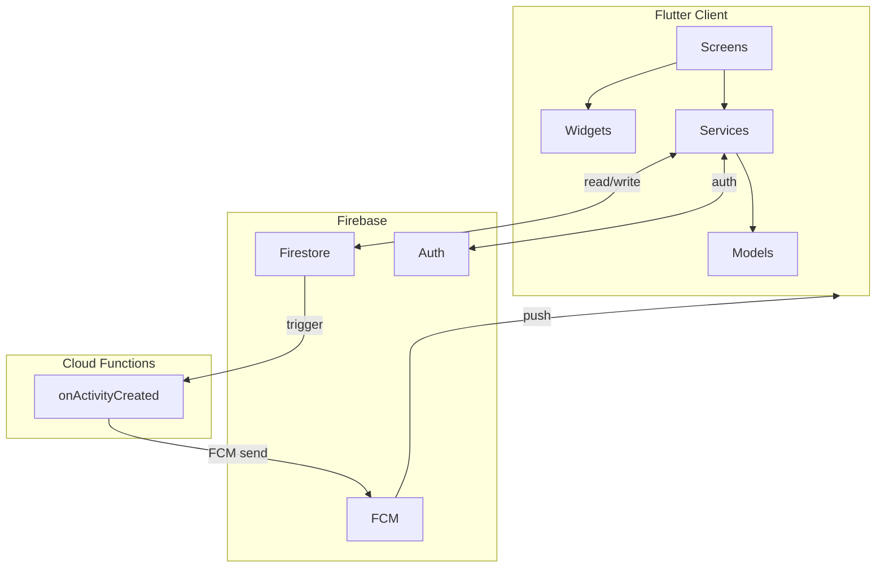
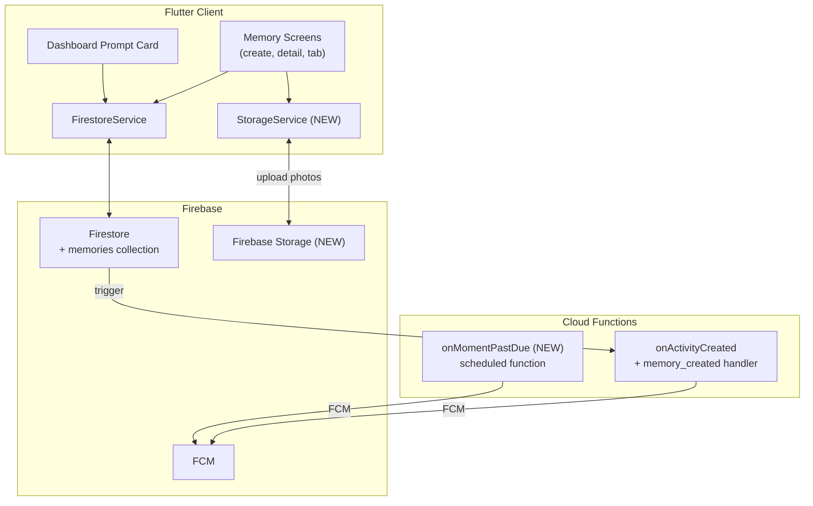
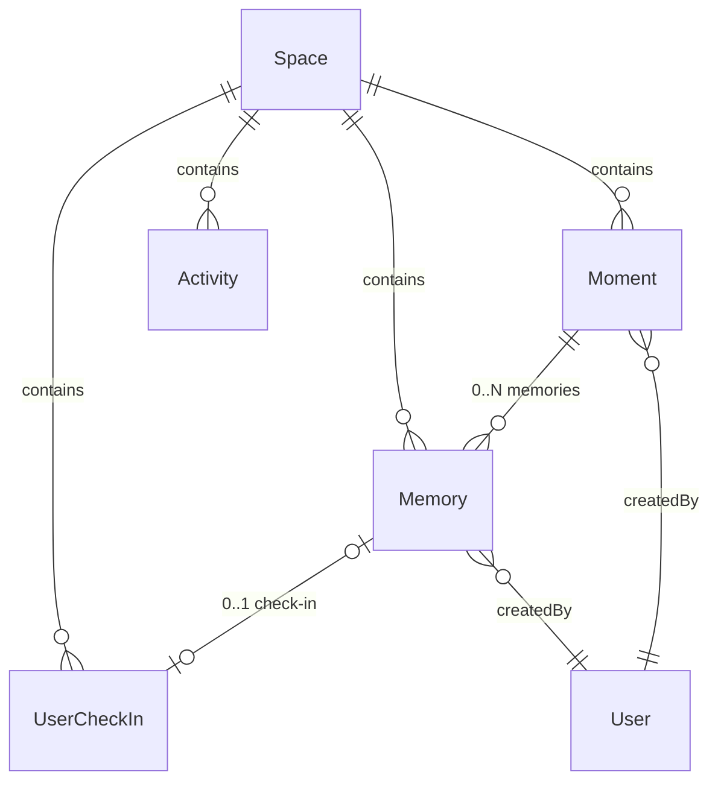
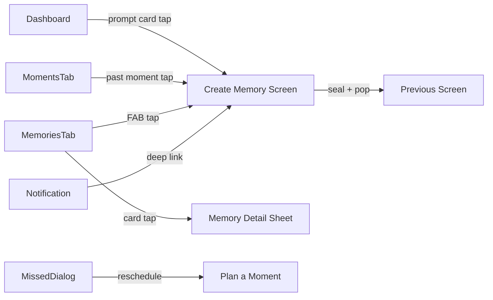

# TDD-001: Memories — Technical Design Document

| Field            | Value                                      |
|------------------|--------------------------------------------|
| **Document ID**  | TDD-001                                    |
| **Feature**      | Memories                                   |
| **PRD**          | PRD-001                                    |
| **Author**       | Engineering                                |
| **Status**       | Draft                                      |
| **Created**      | 2026-03-12                                 |
| **Last Updated** | 2026-03-12                                 |

---

## Table of Contents

1. [Overview](#1-overview)
2. [System Context](#2-system-context)
3. [Data Model](#3-data-model)
4. [Firestore Schema & Indexes](#4-firestore-schema--indexes)
5. [Firebase Storage](#5-firebase-storage)
6. [Security Rules](#6-security-rules)
7. [Service Layer](#7-service-layer)
8. [Screen Architecture](#8-screen-architecture)
9. [Widget Inventory](#9-widget-inventory)
10. [Navigation & Routing](#10-navigation--routing)
11. [Notification & Cloud Functions](#11-notification--cloud-functions)
12. [Scoring Engine Integration](#12-scoring-engine-integration)
13. [Activity Trail Integration](#13-activity-trail-integration)
14. [File Manifest](#14-file-manifest)
15. [Migration & Backward Compatibility](#15-migration--backward-compatibility)
16. [Testing Strategy](#16-testing-strategy)
17. [Implementation Order](#17-implementation-order)
18. [Open Technical Decisions](#18-open-technical-decisions)

---

## 1. Overview

This document defines the technical design for the Memories feature (PRD-001). It maps every product requirement to concrete implementation details: data models, Firestore paths, service methods, screen widgets, routes, cloud functions, and security rules. All designs follow established codebase patterns documented in the project README and `.cursorrules`.

### Design Principles (Inherited)

1. **Simplicity First** — `setState` for local state, no state management libraries.
2. **Real-time by Default** — Firestore streams via `StreamSubscription` with `mounted` checks.
3. **DRY** — Reuse `ActiveCard`, `SlideToAction`, `VerticalBarSlider`, `PremiumCard`, `EmptyState`.
4. **UTC-First** — All dates stored as UTC midnight; local conversion in UI only.
5. **Centralized Theme** — `AppColors`, `AppTypography`, `AppSpacing` everywhere.

---

## 2. System Context

### Current Architecture



### Additions for Memories



**New infrastructure:**
- Firebase Storage for photo uploads.
- `StorageService` — new service class for upload/delete operations.
- `onMomentPastDue` — scheduled Cloud Function for memory prompt notifications.

---

## 3. Data Model

### 3.1 Memory Model

**File:** `lib/models/memory.dart` (new)

```dart
enum MomentStatus {
  planned('planned'),
  lived('lived'),
  missed('missed');

  const MomentStatus(this.value);
  final String value;

  static MomentStatus fromValue(String value) {
    return MomentStatus.values.firstWhere(
      (e) => e.value == value,
      orElse: () => MomentStatus.planned,
    );
  }
}

class Memory {
  const Memory({
    required this.id,
    required this.createdBy,
    required this.date,
    required this.createdAt,
    this.momentId,
    this.title,
    this.photoUrls = const [],
    this.caption = '',
    this.place,
    this.music,
    this.checkinId,
  });

  final String id;
  final String? momentId;
  final String? title;            // standalone memories only
  final String createdBy;
  final List<String> photoUrls;   // max 3, Firebase Storage download URLs
  final String caption;           // max 280 chars
  final String? place;            // max 100 chars
  final String? music;            // max 100 chars
  final String? checkinId;        // linked UserCheckIn ID
  final DateTime date;            // when the experience happened (UTC midnight)
  final DateTime createdAt;       // when sealed

  // -------------------------------------------------------------------------
  // Computed
  // -------------------------------------------------------------------------

  bool get isStandalone => momentId == null;
  bool get hasPhotos => photoUrls.isNotEmpty;
  bool get hasCheckin => checkinId != null;
  String get displayTitle => title ?? '';

  // -------------------------------------------------------------------------
  // Serialization
  // -------------------------------------------------------------------------

  factory Memory.fromFirestore(DocumentSnapshot doc) {
    final data = doc.data()! as Map<String, dynamic>;
    return Memory.fromJson(doc.id, data);
  }

  factory Memory.fromJson(String id, Map<String, dynamic> json) {
    return Memory(
      id: id,
      momentId: json['momentId'] as String?,
      title: json['title'] as String?,
      createdBy: json['createdBy'] as String,
      photoUrls: List<String>.from(json['photoUrls'] ?? []),
      caption: json['caption'] as String? ?? '',
      place: json['place'] as String?,
      music: json['music'] as String?,
      checkinId: json['checkinId'] as String?,
      date: (json['date'] as Timestamp).toDate(),
      createdAt: (json['createdAt'] as Timestamp).toDate(),
    );
  }

  Map<String, dynamic> toJson() {
    return {
      if (momentId != null) 'momentId': momentId,
      if (title != null) 'title': title,
      'createdBy': createdBy,
      'photoUrls': photoUrls,
      'caption': caption,
      if (place != null) 'place': place,
      if (music != null) 'music': music,
      if (checkinId != null) 'checkinId': checkinId,
      'date': Timestamp.fromDate(date),
      'createdAt': FieldValue.serverTimestamp(),
    };
  }

  Memory copyWith({ ... });
}
```

**Pattern alignment:**
- Follows `Moment` model: `const` constructor, `fromFirestore` → `fromJson`, `toJson()`, `copyWith`.
- Enum uses `.value` string with `fromValue` and `orElse` fallback (same as `MomentType`, `TimeSlot`).
- Dates stored as `Timestamp`, normalized to UTC midnight.
- `createdAt` uses `FieldValue.serverTimestamp()` on write (same as `Moment.createdAt`).

### 3.2 Moment Model Update

**File:** `lib/models/moment.dart` (modified)

Add `MomentStatus` enum (defined in `memory.dart`, imported here) and a `status` field:

```dart
class Moment {
  const Moment({
    // ... existing fields ...
    this.status = MomentStatus.planned,   // NEW
  });

  final MomentStatus status;              // NEW

  // fromJson: parse status with fallback
  // status: MomentStatus.fromValue(json['status'] as String? ?? 'planned')

  // toJson: include status
  // 'status': status.value,

  // copyWith: include status
}
```

**Backward compatibility:** Existing documents without `status` default to `planned` via `?? 'planned'` in `fromJson`.

### 3.3 Activity Model Update

**File:** `lib/models/activity.dart` (modified)

Add two new enum values:

```dart
enum ActivityType {
  // ... existing values ...
  memoryCreated('memory_created', 'sealed a memory'),     // NEW
  momentMissed('moment_missed', 'marked as missed'),      // NEW
}
```

Add to `EntityType`:

```dart
enum EntityType {
  checkin('checkin'),
  moment('moment'),
  space('space'),
  memory('memory'),       // NEW
}
```

### 3.4 Entity Relationship Diagram



---

## 4. Firestore Schema & Indexes

### 4.1 Collection Path

```
spaces/{spaceId}/memories/{memoryId}
```

### 4.2 Document Shape

```json
{
  "momentId": "string | null",
  "title": "string | null",
  "createdBy": "string",
  "photoUrls": ["url1", "url2", "url3"],
  "caption": "string",
  "place": "string | null",
  "music": "string | null",
  "checkinId": "string | null",
  "date": "Timestamp",
  "createdAt": "Timestamp (server)"
}
```

### 4.3 Required Indexes

| Collection | Fields | Order | Purpose |
|------------|--------|-------|---------|
| `memories` | `date` | DESC | Timeline sort (newest first) |
| `memories` | `momentId`, `createdAt` | ASC | Group memories by moment |
| `memories` | `createdBy`, `date` | DESC | User-specific queries |

### 4.4 Updated Moment Document

Existing `moments/{momentId}` gains:

```json
{
  "status": "planned | lived | missed"
}
```

No index change needed — `status` is read inline, not queried standalone in V1.

---

## 5. Firebase Storage

### 5.1 Bucket Structure

```
spaces/{spaceId}/memories/{memoryId}/
  ├── photo_0.jpg
  ├── photo_1.jpg
  └── photo_2.jpg
```

### 5.2 Upload Strategy

1. User picks images via `image_picker`.
2. Images are compressed client-side before upload (max 1920px longest edge, JPEG quality 80).
3. Each image is uploaded sequentially to `spaces/{spaceId}/memories/{memoryId}/photo_{index}.{ext}`.
4. Download URLs are collected via `getDownloadURL()`.
5. URLs are stored in the memory document's `photoUrls` array.

### 5.3 Constraints

| Constraint | Value | Enforced At |
|------------|-------|-------------|
| Max photos per memory | 3 | Client (UI) |
| Max file size | 10 MB | Storage rules + client validation |
| Content type | `image/*` | Storage rules |
| Compression target | ~500 KB per image | Client (before upload) |

### 5.4 StorageService

**File:** `lib/services/storage_service.dart` (new)

```dart
class StorageService {
  final _storage = FirebaseStorage.instance;

  Future<List<String>> uploadMemoryPhotos({
    required String spaceId,
    required String memoryId,
    required List<File> photos,
  }) async {
    final urls = <String>[];
    for (var i = 0; i < photos.length; i++) {
      final ref = _storage
          .ref('spaces/$spaceId/memories/$memoryId/photo_$i.jpg');
      final task = await ref.putFile(
        photos[i],
        SettableMetadata(contentType: 'image/jpeg'),
      );
      urls.add(await task.ref.getDownloadURL());
    }
    return urls;
  }

  Future<void> deleteMemoryPhotos({
    required String spaceId,
    required String memoryId,
  }) async {
    final listResult = await _storage
        .ref('spaces/$spaceId/memories/$memoryId')
        .listAll();
    for (final item in listResult.items) {
      await item.delete();
    }
  }
}
```

---

## 6. Security Rules

### 6.1 Firestore Rules Addition

**File:** `firestore.rules` (modified)

Add inside the `match /spaces/{spaceId}` block, alongside existing `moments`, `checkins`, `activities`:

```javascript
match /memories/{memoryId} {
  allow read: if request.auth != null
    && request.auth.uid in get(/databases/$(database)/documents/spaces/$(spaceId)).data.memberIds;

  allow create: if request.auth != null
    && request.auth.uid in get(/databases/$(database)/documents/spaces/$(spaceId)).data.memberIds
    && request.resource.data.createdBy == request.auth.uid
    && request.resource.data.keys().hasAll(['createdBy', 'date', 'createdAt', 'photoUrls', 'caption']);

  // No update or delete — memories are immutable
  allow update, delete: if false;
}
```

**Key decisions:**
- `create` validates `createdBy == auth.uid` (can't create memories as your partner).
- `update` and `delete` are explicitly denied (immutability enforced server-side).
- Schema validation ensures required fields are present.

### 6.2 Storage Rules

**File:** `storage.rules` (new or appended to existing)

```javascript
rules_version = '2';
service firebase.storage {
  match /b/{bucket}/o {
    match /spaces/{spaceId}/memories/{memoryId}/{fileName} {
      allow read: if request.auth != null
        && firestore.get(/databases/(default)/documents/spaces/$(spaceId)).data.memberIds.hasAny([request.auth.uid]);

      allow write: if request.auth != null
        && firestore.get(/databases/(default)/documents/spaces/$(spaceId)).data.memberIds.hasAny([request.auth.uid])
        && request.resource.size < 10 * 1024 * 1024
        && request.resource.contentType.matches('image/.*');

      allow delete: if false;
    }
  }
}
```

---

## 7. Service Layer

### 7.1 FirestoreService Additions

**File:** `lib/services/firestore_service.dart` (modified)

New methods to add:

```dart
// ---------------------------------------------------------------------------
// Memories
// ---------------------------------------------------------------------------

/// Creates a memory document. Returns the new document ID.
Future<String> createMemory({
  required String spaceId,
  required String createdBy,
  required DateTime date,
  String? momentId,
  String? title,
  List<String> photoUrls = const [],
  String caption = '',
  String? place,
  String? music,
  String? checkinId,
}) async {
  final doc = _firestore
      .collection('spaces').doc(spaceId)
      .collection('memories').doc();

  final memory = Memory(
    id: doc.id,
    momentId: momentId,
    title: title,
    createdBy: createdBy,
    photoUrls: photoUrls,
    caption: caption,
    place: place,
    music: music,
    checkinId: checkinId,
    date: date,
    createdAt: DateTime.now(), // placeholder, server timestamp used
  );

  await doc.set(memory.toJson());
  return doc.id;
}

/// Watches all memories in a space, ordered by date descending.
Stream<List<Memory>> watchMemories(String spaceId) {
  return _firestore
      .collection('spaces').doc(spaceId)
      .collection('memories')
      .orderBy('date', descending: true)
      .snapshots()
      .map((snap) => snap.docs
          .map((doc) => Memory.fromFirestore(doc))
          .toList());
}

/// Fetches memories for a specific moment.
Future<List<Memory>> getMemoriesForMoment({
  required String spaceId,
  required String momentId,
}) async {
  final snap = await _firestore
      .collection('spaces').doc(spaceId)
      .collection('memories')
      .where('momentId', isEqualTo: momentId)
      .orderBy('createdAt')
      .get();
  return snap.docs.map((doc) => Memory.fromFirestore(doc)).toList();
}

/// Gets past moments that have no memory and are not marked missed.
/// Used by the dashboard prompt card.
Future<List<Moment>> getPastMomentsAwaitingMemory(String spaceId) async {
  final snap = await _firestore
      .collection('spaces').doc(spaceId)
      .collection('moments')
      .where('status', isEqualTo: 'planned')
      .get();

  final now = DateTime.now().toUtc();
  final today = DateTime.utc(now.year, now.month, now.day);

  return snap.docs
      .map((doc) => Moment.fromFirestore(doc))
      .where((m) {
        final end = m.endDate ?? m.startDate;
        return end.isBefore(today);
      })
      .toList()
    ..sort((a, b) => (b.endDate ?? b.startDate)
        .compareTo(a.endDate ?? a.startDate));
}

/// Updates a moment's status field.
Future<void> updateMomentStatus({
  required String spaceId,
  required String momentId,
  required MomentStatus status,
}) async {
  await _firestore
      .collection('spaces').doc(spaceId)
      .collection('moments').doc(momentId)
      .update({'status': status.value});
}
```

### 7.2 Activity Logging Methods

Add to `FirestoreService`:

```dart
Future<void> logMemoryCreatedActivity({
  required String spaceId,
  required String userId,
  required String userName,
  required String memoryId,
  String? momentId,
  required String memoryTitle,
}) async {
  await logActivity(
    spaceId: spaceId,
    type: ActivityType.memoryCreated,
    actorId: userId,
    actorName: userName,
    entityType: EntityType.memory,
    entityId: memoryId,
    metadata: {
      'memoryTitle': memoryTitle,
      if (momentId != null) 'momentId': momentId,
    },
  );
}

Future<void> logMomentMissedActivity({
  required String spaceId,
  required String userId,
  required String userName,
  required String momentId,
  required String momentName,
  required String momentType,
  required bool rescheduled,
}) async {
  await logActivity(
    spaceId: spaceId,
    type: ActivityType.momentMissed,
    actorId: userId,
    actorName: userName,
    entityType: EntityType.moment,
    entityId: momentId,
    metadata: {
      'momentName': momentName,
      'momentType': momentType,
      'rescheduled': rescheduled,
    },
  );
}
```

---

## 8. Screen Architecture

### 8.1 Screen Inventory

| Screen | File | Type | Purpose |
|--------|------|------|---------|
| `MemoriesTab` | `lib/screens/memories/memories_tab.dart` | StatefulWidget | Timeline showcase (3rd tab) |
| `CreateMemoryScreen` | `lib/screens/memory/create_memory_screen.dart` | StatefulWidget | Memory creation flow |
| `MemoryDetailSheet` | `lib/screens/memory/memory_detail_sheet.dart` | Function (showModalBottomSheet) | Read-only memory detail |
| `MemoryPromptCard` | `lib/screens/dashboard/widgets/memory_prompt_card.dart` | StatelessWidget | Dashboard prompt |

### 8.2 CreateMemoryScreen — Detailed Design

**Pattern:** Mirrors `PlanMomentScreen` — single scrollable view with progressive reveal and `SlideToAction` bottom bar.

```dart
class CreateMemoryScreen extends StatefulWidget {
  const CreateMemoryScreen({
    super.key,
    required this.spaceId,
    this.moment,          // non-null when creating from a lived moment
  });

  final String spaceId;
  final Moment? moment;   // pre-fill context
}

class _CreateMemoryScreenState extends State<CreateMemoryScreen> {
  // ---------------------------------------------------------------------------
  // Services
  // ---------------------------------------------------------------------------
  final _firestoreService = FirestoreService();
  final _storageService = StorageService();
  final _authService = AuthService();

  // ---------------------------------------------------------------------------
  // State
  // ---------------------------------------------------------------------------

  // Content
  List<File> _photos = [];
  final _captionController = TextEditingController();
  final _placeController = TextEditingController();
  final _musicController = TextEditingController();
  final _titleController = TextEditingController();    // standalone only
  DateTime? _date;                                      // standalone only

  // Pulse check-in (embedded)
  Map<String, double> _scores = {};
  PulseConfig? _pulseConfig;
  StreamSubscription? _configSub;
  bool _slidersInteracted = false;

  // UI
  bool _isSealing = false;
  bool _showSealButton = false;

  // ---------------------------------------------------------------------------
  // Computed
  // ---------------------------------------------------------------------------

  bool get _isStandalone => widget.moment == null;
  bool get _canSeal => _isStandalone
      ? _titleController.text.trim().isNotEmpty && _date != null
      : true;   // moment-linked memories have no required fields
  String get _displayTitle => _isStandalone
      ? _titleController.text.trim()
      : widget.moment!.name;

  // ---------------------------------------------------------------------------
  // Lifecycle
  // ---------------------------------------------------------------------------

  @override
  void initState() {
    super.initState();
    _date = widget.moment?.startDate;
    _subscribeToPulseConfig();
  }

  @override
  void dispose() {
    _captionController.dispose();
    _placeController.dispose();
    _musicController.dispose();
    _titleController.dispose();
    _configSub?.cancel();
    super.dispose();
  }

  // ---------------------------------------------------------------------------
  // Actions
  // ---------------------------------------------------------------------------

  Future<void> _pickPhotos() async { /* image_picker, max 3 */ }

  void _removePhoto(int index) {
    setState(() => _photos.removeAt(index));
  }

  Future<void> _seal() async {
    if (_isSealing) return;
    FocusScope.of(context).unfocus();
    setState(() => _isSealing = true);

    try {
      final userId = _authService.currentUser!.uid;
      final memoryId = _firestoreService /* generate doc ID */;

      // 1. Upload photos
      List<String> photoUrls = [];
      if (_photos.isNotEmpty) {
        photoUrls = await _storageService.uploadMemoryPhotos(
          spaceId: widget.spaceId,
          memoryId: memoryId,
          photos: _photos,
        );
      }

      // 2. Submit embedded check-in (if sliders were touched)
      String? checkinId;
      if (_slidersInteracted && _pulseConfig != null) {
        final intScores = _scores.map((k, v) => MapEntry(k, v.round()));
        checkinId = await _firestoreService.submitCheckIn(
          spaceId: widget.spaceId,
          userId: userId,
          scores: intScores,
          configSnapshot: _pulseConfig!.toConfigSnapshot(userId),
          notes: '',
        );
      }

      // 3. Create memory document
      await _firestoreService.createMemory(
        spaceId: widget.spaceId,
        createdBy: userId,
        date: _date!,
        momentId: widget.moment?.id,
        title: _isStandalone ? _titleController.text.trim() : null,
        photoUrls: photoUrls,
        caption: _captionController.text.trim(),
        place: _placeController.text.trim().isEmpty
            ? null : _placeController.text.trim(),
        music: _musicController.text.trim().isEmpty
            ? null : _musicController.text.trim(),
        checkinId: checkinId,
      );

      // 4. Update moment status to lived (if linked)
      if (widget.moment != null) {
        await _firestoreService.updateMomentStatus(
          spaceId: widget.spaceId,
          momentId: widget.moment!.id,
          status: MomentStatus.lived,
        );
      }

      // 5. Log activity
      await _firestoreService.logMemoryCreatedActivity(
        spaceId: widget.spaceId,
        userId: userId,
        userName: /* from user doc */,
        memoryId: memoryId,
        momentId: widget.moment?.id,
        memoryTitle: _displayTitle,
      );

      HapticFeedback.heavyImpact();
      if (mounted) context.pop();
    } catch (e) {
      if (mounted) {
        ScaffoldMessenger.of(context).showSnackBar(
          SnackBar(content: Text('Error: $e'), backgroundColor: AppColors.error),
        );
      }
    } finally {
      if (mounted) setState(() => _isSealing = false);
    }
  }

  // ---------------------------------------------------------------------------
  // Build
  // ---------------------------------------------------------------------------

  @override
  Widget build(BuildContext context) { /* ... */ }

  Widget _buildHeader() { /* moment name + date OR title field + date picker */ }
  Widget _buildPhotoSection() { /* photo picker grid */ }
  Widget _buildCaptionField() { /* ActiveCard with text field */ }
  Widget _buildPlaceField() { /* ActiveCard with text field */ }
  Widget _buildMusicField() { /* ActiveCard with text field */ }
  Widget _buildPulseSection() { /* embedded VerticalBarSlider set */ }
  Widget _buildStickyBottom() { /* SlideToAction or null */ }
}
```

**Key design decisions:**
- `moment` parameter is nullable: non-null = from-moment, null = standalone.
- Photos are `File` objects until seal, then uploaded to Storage.
- Pulse sliders are only materialized as a `UserCheckIn` if interacted with (`_slidersInteracted` flag).
- The seal operation is a sequential pipeline: upload → check-in → memory → status → activity → pop.

### 8.3 MemoriesTab — Timeline

**Pattern:** Mirrors `MomentsTab` — stream subscription, `mounted` checks, card-based layout.

```dart
class MemoriesTab extends StatefulWidget {
  const MemoriesTab({super.key, required this.spaceId});
  final String spaceId;
}

class _MemoriesTabState extends State<MemoriesTab> {
  final _firestoreService = FirestoreService();

  StreamSubscription? _memoriesSub;
  List<Memory> _allMemories = [];
  bool _isLoading = true;

  // Group memories by momentId for thread display
  Map<String?, List<Memory>> get _grouped {
    final map = <String?, List<Memory>>{};
    for (final m in _allMemories) {
      map.putIfAbsent(m.momentId, () => []).add(m);
    }
    return map;
  }

  @override
  void initState() {
    super.initState();
    _subscribe();
  }

  void _subscribe() {
    _memoriesSub = _firestoreService
        .watchMemories(widget.spaceId)
        .listen((memories) {
      if (!mounted) return;
      setState(() {
        _allMemories = memories;
        _isLoading = false;
      });
    });
  }

  @override
  void dispose() {
    _memoriesSub?.cancel();
    super.dispose();
  }

  @override
  Widget build(BuildContext context) {
    if (_isLoading) return /* loading */;
    if (_allMemories.isEmpty) return _buildEmptyState();
    return _buildTimeline();
  }

  Widget _buildTimeline() { /* ListView with grouped cards */ }
  Widget _buildMomentGroup(String momentId, List<Memory> memories) { /* header + cards */ }
  Widget _buildMemoryCard(Memory memory) { /* photo strip, caption, tags, avatar */ }
  Widget _buildEmptyState() { /* EmptyState widget */ }
}
```

### 8.4 MemoryPromptCard — Dashboard

**Pattern:** Mirrors `ComingUpCard` from `event_cards.dart`.

```dart
class MemoryPromptCard extends StatelessWidget {
  const MemoryPromptCard({
    super.key,
    required this.moment,
    required this.onCreateMemory,
    required this.onMissed,
    required this.onDismiss,
  });

  final Moment moment;
  final VoidCallback onCreateMemory;
  final VoidCallback onMissed;
  final VoidCallback onDismiss;
}
```

**Layout:**
- Card label: "REMEMBER" (uppercase, `AppTypography.cardLabel()`)
- Moment type icon + moment name + formatted date
- Two CTAs: "Create Memory" (accent red) | "Didn't happen" (muted)
- Dismiss X button in corner

### 8.5 MemoryDetailSheet

**Pattern:** Mirrors `MomentDetailsSheet` — `showModalBottomSheet` with `DraggableScrollableSheet`.

Content sections (read-only):
1. Header: title/moment name + date + creator name
2. Photo carousel (horizontal scroll)
3. Caption text
4. Place tag (if present)
5. Music tag (if present)
6. Pulse summary (if `checkinId` present): load `UserCheckIn`, display attribute scores as colored bars

---

## 9. Widget Inventory

### 9.1 New Widgets

| Widget | File | Description |
|--------|------|-------------|
| `PhotoPickerGrid` | `lib/widgets/photo_picker_grid.dart` | 3-slot photo grid with add/remove |
| `MemoryCard` | `lib/widgets/memory_card.dart` | Timeline card for a single memory |
| `MomentGroupHeader` | `lib/widgets/moment_group_header.dart` | Header for grouped memories under a moment |

### 9.2 Reused Widgets

| Widget | Source | Usage in Memories |
|--------|--------|-------------------|
| `ActiveCard` | `widgets/active_card.dart` | Section cards in creation flow |
| `SlideToAction` | `widgets/slide_to_action.dart` | "Seal this memory" |
| `VerticalBarSlider` | `widgets/dotted_slider.dart` | Embedded pulse check-in |
| `PremiumCard` | `widgets/neumorphic_container.dart` | Memory cards in timeline |
| `EmptyState` | `widgets/neumorphic_container.dart` | Empty memories tab |
| `SectionHeader` | `widgets/neumorphic_container.dart` | Section headers |
| `getMomentTypeIconWidget` | `widgets/moment_type_icon.dart` | Moment type icon on grouped headers |
| `AppDateCalendar` | `widgets/app_calendar.dart` | Date picker in standalone creation |

### 9.3 Barrel Export Update

**File:** `lib/widgets/widgets.dart` (modified)

Add:
```dart
export 'photo_picker_grid.dart';
export 'memory_card.dart';
export 'moment_group_header.dart';
```

---

## 10. Navigation & Routing

### 10.1 New Routes

**File:** `lib/router/app_router.dart` (modified)

```dart
GoRoute(
  path: '/memory/:spaceId/create',
  name: 'createMemory',
  pageBuilder: (context, state) {
    final spaceId = state.pathParameters['spaceId']!;
    final moment = state.extra as Moment?;
    return _slideTransition(
      state,
      CreateMemoryScreen(spaceId: spaceId, moment: moment),
    );
  },
),
```

### 10.2 Navigation Map



### 10.3 Tab Index Update

**File:** `lib/screens/main_shell.dart` (modified)

```
Tab 0: Dashboard
Tab 1: Moments
Tab 2: Memories (was: Coming Soon)
```

The stretchy tab selector currently has 5 visual slots mapped to 3 tabs (0, 1, 2). Tab 2 is the "Coming Soon" placeholder. Replace `_ComingSoonPage` with `MemoriesTab`.

Key changes in `_MainShellState`:
- Replace `_ComingSoonPage()` with `MemoriesTab(spaceId: widget.spaceId)` in `_tabs`.
- Update app bar title for tab 2 from "Coming Soon" to "Memories".
- Update the tab icon for slot 2+ from current icon to `Icons.auto_stories` (book).

---

## 11. Notification & Cloud Functions

### 11.1 Memory Prompt Notification

**Approach:** A scheduled Cloud Function runs daily (e.g., 9 AM UTC) and checks for past moments awaiting memory.

**File:** `functions/src/index.ts` (modified)

```typescript
// New scheduled function
export const sendMemoryPrompts = onSchedule(
  { schedule: 'every day 09:00', timeZone: 'UTC' },
  async () => {
    // 1. Query all spaces
    // 2. For each space, find moments where:
    //    - status == 'planned'
    //    - endDate (or startDate) < today
    // 3. For each such moment, send FCM to both members
    //    with title: "How was {momentName}?"
    //    and body: "Seal it as a memory before it fades"
    //    and data: { type: 'memory_prompt', spaceId, momentId }
  }
);
```

### 11.2 Memory Created Notification

Add to existing `onActivityCreated` function:

```typescript
// In buildNotificationContent:
case 'memory_created':
  return {
    title: `${activity.actorName} sealed a memory`,
    body: `for "${metadata.memoryTitle}"`,
  };

case 'moment_missed':
  return {
    title: `${activity.actorName} marked a moment as missed`,
    body: `"${metadata.momentName}"`,
  };
```

### 11.3 NotificationService Update

**File:** `lib/services/notification_service.dart` (modified)

Update `NotificationNavigation`:
```dart
bool get isMemoryPrompt => type == 'memory_prompt';
bool get isMemoryCreated => type == 'memory_created';
```

**File:** `lib/screens/main_shell.dart` (modified)

Handle `isMemoryPrompt` in the notification tap listener:
```dart
if (nav.isMemoryPrompt) {
  final moment = await _firestoreService.getMoment(
    spaceId: widget.spaceId,
    momentId: nav.entityId,
  );
  if (mounted && moment != null) {
    context.push('/memory/${widget.spaceId}/create', extra: moment);
  }
}
```

### 11.4 NotificationPreferences Update

**File:** `lib/models/notification_preferences.dart` (modified)

Add default configs for new activity types:
```dart
ActivityType.memoryCreated: ActivityNotificationConfig(
  activityType: ActivityType.memoryCreated,
  priority: NotificationPriority.normal,
),
ActivityType.momentMissed: ActivityNotificationConfig(
  activityType: ActivityType.momentMissed,
  priority: NotificationPriority.low,
),
```

---

## 12. Scoring Engine Integration

The embedded pulse check-in in a memory creates a standard `UserCheckIn` document via the existing `submitCheckIn` method. This means:

- It flows through the existing scoring pipeline (`CheckInScoreSource` → `ScoreEngine`).
- It contributes to the 30-day health score window.
- It appears in `watchRecentCheckIns` alongside regular check-ins.
- No changes to `lib/scoring/` are needed.

The only consideration: the check-in's `timestamp` will be the memory creation time, not the moment's date. This is correct behavior — the check-in reflects how the user feels at reflection time.

---

## 13. Activity Trail Integration

### 13.1 New Activity Types Display

**File:** `lib/screens/dashboard/widgets/activity_trail.dart` (modified)

Add display logic for new activity types:

| ActivityType | Icon | Color | Description Template |
|-------------|------|-------|---------------------|
| `memoryCreated` | `Icons.auto_stories` | `AppColors.accentRed` | "{Actor} sealed a memory for **{memoryTitle}**" |
| `momentMissed` | `Icons.event_busy` | `AppColors.warmMuted` | "{Actor} marked **{momentName}** as missed" |

Both types should be navigable:
- `memoryCreated` → open memory detail sheet.
- `momentMissed` → no navigation (moment is archived).

---

## 14. File Manifest

### 14.1 New Files

| File | Purpose |
|------|---------|
| `lib/models/memory.dart` | Memory model + MomentStatus enum |
| `lib/services/storage_service.dart` | Firebase Storage upload/delete |
| `lib/screens/memory/create_memory_screen.dart` | Memory creation flow |
| `lib/screens/memory/memory_detail_sheet.dart` | Read-only detail view |
| `lib/screens/memory/memory.dart` | Barrel export |
| `lib/screens/memories/memories_tab.dart` | Memories tab (timeline) |
| `lib/screens/dashboard/widgets/memory_prompt_card.dart` | Dashboard prompt |
| `lib/widgets/photo_picker_grid.dart` | Photo selection grid |
| `lib/widgets/memory_card.dart` | Timeline memory card |
| `lib/widgets/moment_group_header.dart` | Grouped moment header |
| `storage.rules` | Firebase Storage security rules |

### 14.2 Modified Files

| File | Changes |
|------|---------|
| `lib/models/moment.dart` | Add `status` field, import `MomentStatus` |
| `lib/models/activity.dart` | Add `memoryCreated`, `momentMissed` to `ActivityType`; add `memory` to `EntityType` |
| `lib/models/notification_preferences.dart` | Add default configs for new activity types |
| `lib/services/firestore_service.dart` | Add memory CRUD, `getPastMomentsAwaitingMemory`, `updateMomentStatus`, activity logging |
| `lib/services/notification_service.dart` | Add `isMemoryPrompt`, `isMemoryCreated` to `NotificationNavigation` |
| `lib/screens/main_shell.dart` | 3rd tab → `MemoriesTab`, notification handling for memory prompts |
| `lib/screens/dashboard/dashboard_tab.dart` | Add `MemoryPromptCard` to dashboard layout |
| `lib/screens/dashboard/widgets/activity_trail.dart` | Display new activity types |
| `lib/router/app_router.dart` | Add `/memory/:spaceId/create` route |
| `lib/widgets/widgets.dart` | Export new widgets |
| `firestore.rules` | Add `memories` collection rules |
| `functions/src/index.ts` | Add `sendMemoryPrompts` function, update `buildNotificationContent` |
| `pubspec.yaml` | Add `firebase_storage`, `image_picker` dependencies |
| `README.md` | Document Memories feature |

### 14.3 New Dependencies

| Package | Purpose |
|---------|---------|
| `firebase_storage` | Photo upload/download |
| `image_picker` | Device gallery access |
| `image` or `flutter_image_compress` | Client-side image compression before upload |

---

## 15. Migration & Backward Compatibility

### 15.1 Moment Status Field

Existing moment documents do not have a `status` field. The `fromJson` factory handles this:

```dart
status: MomentStatus.fromValue(json['status'] as String? ?? 'planned')
```

All existing moments are treated as `planned`. No Firestore migration script is needed.

### 15.2 Activity Type Enum

New enum values (`memoryCreated`, `momentMissed`) are additive. The existing `fromValue` pattern with `orElse` fallback ensures old clients won't crash on unknown activity types. Old clients will display unknown activities with a generic fallback.

### 15.3 Cloud Functions

The `buildNotificationContent` switch statement needs `case` entries for new activity types. Missing cases should fall through to a generic message (existing behavior).

---

## 16. Testing Strategy

### 16.1 Unit Tests

| Test File | Scope |
|-----------|-------|
| `test/models/memory_test.dart` | `Memory.fromJson`, `toJson`, computed properties, `MomentStatus` enum |
| `test/models/moment_status_test.dart` | Status field backward compatibility, enum round-trip |
| `test/services/firestore_service_memory_test.dart` | CRUD operations (mock Firestore) |

### 16.2 Widget Tests

| Test File | Scope |
|-----------|-------|
| `test/screens/memory/create_memory_screen_test.dart` | Form validation, progressive reveal, seal flow |
| `test/screens/memories/memories_tab_test.dart` | Timeline rendering, grouping, empty state |
| `test/widgets/memory_prompt_card_test.dart` | Prompt card CTAs, dismiss |
| `test/widgets/photo_picker_grid_test.dart` | Add/remove photos, max 3 limit |

### 16.3 Integration Tests

| Test | Scope |
|------|-------|
| Memory from moment E2E | Create moment → date passes → prompt → create memory → verify timeline |
| Standalone memory E2E | Open memories tab → FAB → fill fields → seal → verify timeline |
| Missed moment E2E | Prompt → "Didn't happen" → reschedule / dismiss → verify status |

### 16.4 Manual Test Checklist

- [ ] Create memory from dashboard prompt (all fields filled)
- [ ] Create memory with zero optional fields (just seal)
- [ ] Create standalone memory
- [ ] Photo upload: 1, 2, 3 photos; remove photo; large photo (>10MB rejected)
- [ ] Caption character limit (280)
- [ ] Pulse sliders: interact → check-in created; skip → no check-in
- [ ] Moment status transitions: planned → lived, planned → missed
- [ ] Missed moment reschedule flow
- [ ] Timeline display: single memory, grouped memories, standalone
- [ ] Memory detail sheet: all fields display correctly
- [ ] Push notification: tap opens creation screen
- [ ] Activity trail: new activity types display correctly
- [ ] Partner sees your memory in their timeline
- [ ] Immutability: no edit/delete options on sealed memory
- [ ] Empty state on Memories tab
- [ ] 3-tab navigation works correctly
- [ ] Keyboard dismissal on all text fields
- [ ] Error handling: network failure during seal
- [ ] `mounted` checks after all async operations

---

## 17. Implementation Order

A phased approach to enable incremental testing:

### Phase 1: Foundation (Data Layer)

1. Create `lib/models/memory.dart` (Memory model + MomentStatus enum)
2. Update `lib/models/moment.dart` (add `status` field)
3. Update `lib/models/activity.dart` (add new enum values)
4. Update `firestore.rules` (add memories collection)
5. Add `firebase_storage` and `image_picker` to `pubspec.yaml`
6. Create `lib/services/storage_service.dart`
7. Add memory methods to `lib/services/firestore_service.dart`
8. Write unit tests for models and service

### Phase 2: Creation Flow

9. Create `lib/widgets/photo_picker_grid.dart`
10. Create `lib/screens/memory/create_memory_screen.dart` (from-moment mode)
11. Add route in `lib/router/app_router.dart`
12. Test creation flow end-to-end (manual)
13. Add standalone mode to `CreateMemoryScreen`
14. Write widget tests for creation screen

### Phase 3: Showcase

15. Create `lib/widgets/memory_card.dart`
16. Create `lib/widgets/moment_group_header.dart`
17. Create `lib/screens/memories/memories_tab.dart`
18. Update `lib/screens/main_shell.dart` (3rd tab)
19. Create `lib/screens/memory/memory_detail_sheet.dart`
20. Write widget tests for timeline

### Phase 4: Prompting

21. Create `lib/screens/dashboard/widgets/memory_prompt_card.dart`
22. Integrate prompt card into `dashboard_tab.dart`
23. Implement missed moment flow (dialog + reschedule + status update)
24. Update activity trail for new activity types
25. Write widget tests for prompt card

### Phase 5: Notifications

26. Update `functions/src/index.ts` (memory activity notifications)
27. Add `sendMemoryPrompts` scheduled function
28. Update `notification_service.dart` and `notification_preferences.dart`
29. Update `main_shell.dart` notification handling
30. Deploy cloud functions and storage rules

### Phase 6: Polish & Documentation

31. Update `lib/widgets/widgets.dart` barrel export
32. Create barrel exports for new screen directories
33. Update `README.md`
34. Create `storage.rules`
35. Run full test suite
36. Manual QA against test checklist

---

## 18. Open Technical Decisions

| # | Decision | Options | Recommendation |
|---|----------|---------|----------------|
| 1 | Memory document ID generation | Auto-generated by Firestore `.doc()` vs. structured `{userId}_{timestamp}` | Auto-generated (simpler, no collision risk) |
| 2 | Photo compression library | `flutter_image_compress` vs. `image` package | `flutter_image_compress` (native, faster) |
| 3 | Memory pagination strategy | Firestore cursor-based vs. limit+offset | Cursor-based with `startAfterDocument` (Firestore best practice) |
| 4 | Scheduled function for prompts | Firebase Scheduled Functions vs. client-side check on app open | Both: client checks on open (immediate), scheduled function sends push (async) |
| 5 | Photo deletion on space delete | Cloud Function cleanup vs. manual | Cloud Function triggered on space deletion (future work) |
| 6 | Maximum memories per moment | Unlimited vs. 1 per user per moment | 1 per user per moment (prevents spam, clear UX) |
| 7 | Memory doc ID pre-generation | Pre-generate before upload (for Storage path) vs. create doc first | Pre-generate via `.doc()` without `.set()` — use ID for Storage path, then `.set()` after upload |

---

*End of Technical Design Document*
